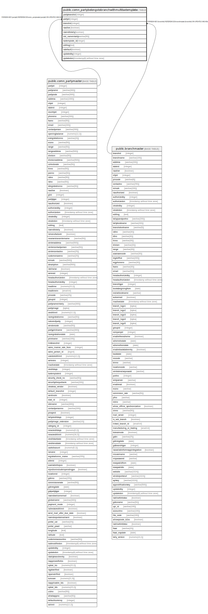

# public.comn_partybelongstobranchwithmultitaxtemplate

## Description

## Columns

| Name | Type | Default | Nullable | Children | Parents | Comment |
| ---- | ---- | ------- | -------- | -------- | ------- | ------- |
| partybranchid | integer | nextval('comn_partybelongstobranchwithmultitaxtemplate_partybranchid_seq'::regclass) | false |  |  |  |
| partyid | integer |  | true |  | [public.comn_partymaster](public.comn_partymaster.md) |  |
| branchid | integer |  | true |  | [public.branchmaster](public.branchmaster.md) |  |
| isactive | boolean | true | true |  |  |  |
| issendtotally | boolean |  | true |  |  |  |
| old_nameintally | varchar(50) |  | true |  |  |  |
| taxtemplate_id | integer |  | true |  |  |  |
| editlog | text |  | true |  |  |  |
| isdefault | boolean | false | true |  |  |  |
| updatedby | integer |  | true |  |  |  |
| updatedon | timestamp(6) without time zone | NULL::timestamp without time zone | true |  |  |  |

## Constraints

| Name | Type | Definition |
| ---- | ---- | ---------- |
| comn_partybelongstobranchwithmultitaxtemplate_fk1 | FOREIGN KEY | FOREIGN KEY (branchid) REFERENCES branchmaster(branchid) ON UPDATE CASCADE |
| comn_partybelongstobranchwithmultitaxtemplate_pkey | PRIMARY KEY | PRIMARY KEY (partybranchid) |
| comn_partybelongstobranchwithmultitaxtemplate_unique | UNIQUE | UNIQUE (partyid, branchid, taxtemplate_id) |
| comn_partybelongstobranchwithmultitaxtemplate_fk | FOREIGN KEY | FOREIGN KEY (partyid) REFERENCES comn_partymaster(partyid) ON UPDATE CASCADE |

## Indexes

| Name | Definition |
| ---- | ---------- |
| comn_partybelongstobranchwithmultitaxtemplate_pkey | CREATE UNIQUE INDEX comn_partybelongstobranchwithmultitaxtemplate_pkey ON public.comn_partybelongstobranchwithmultitaxtemplate USING btree (partybranchid) |
| comn_partybelongstobranchwithmultitaxtemplate_unique | CREATE UNIQUE INDEX comn_partybelongstobranchwithmultitaxtemplate_unique ON public.comn_partybelongstobranchwithmultitaxtemplate USING btree (partyid, branchid, taxtemplate_id) |

## Relations

---

> Generated by [tbls](https://github.com/k1LoW/tbls)
