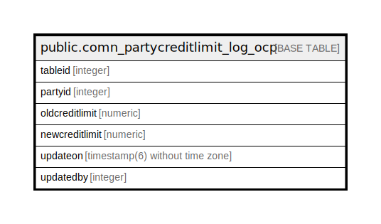

# public.comn_partycreditlimit_log_ocp

## Description

## Columns

| Name | Type | Default | Nullable | Children | Parents | Comment |
| ---- | ---- | ------- | -------- | -------- | ------- | ------- |
| tableid | integer | nextval('comn_partycreditlimit_log_ocp_tableid_seq'::regclass) | false |  |  |  |
| partyid | integer | 0 | false |  |  |  |
| oldcreditlimit | numeric | 0 | false |  |  |  |
| newcreditlimit | numeric | 0 | false |  |  |  |
| updateon | timestamp(6) without time zone |  | true |  |  |  |
| updatedby | integer |  | true |  |  |  |

## Constraints

| Name | Type | Definition |
| ---- | ---- | ---------- |
| comn_partycreditlimit_log_ocp_pkey | PRIMARY KEY | PRIMARY KEY (tableid) |

## Indexes

| Name | Definition |
| ---- | ---------- |
| comn_partycreditlimit_log_ocp_pkey | CREATE UNIQUE INDEX comn_partycreditlimit_log_ocp_pkey ON public.comn_partycreditlimit_log_ocp USING btree (tableid) |

## Relations

---

> Generated by [tbls](https://github.com/k1LoW/tbls)
