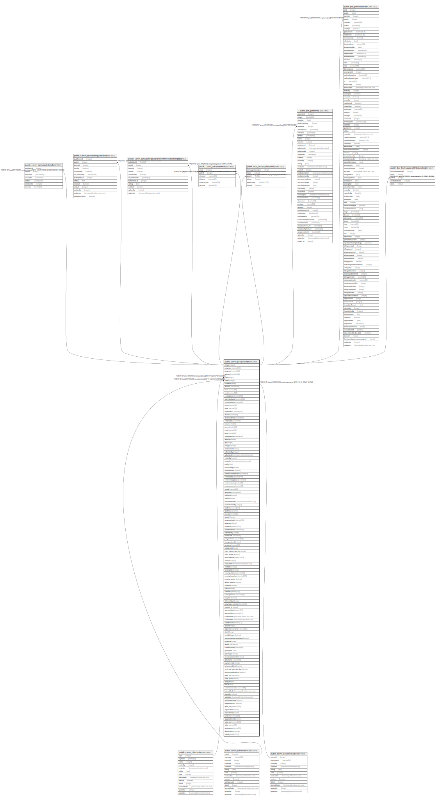

# public.comn_partymaster

## Description

## Columns

| Name | Type | Default | Nullable | Children | Parents | Comment |
| ---- | ---- | ------- | -------- | -------- | ------- | ------- |
| partyid | integer | nextval('comn_partymaster_partyid_seq'::regclass) | false | [public.comn_partybankdetail](public.comn_partybankdetail.md) [public.comn_partybelongstobranch](public.comn_partybelongstobranch.md) [public.comn_partybelongstobranchwithmultitaxtemplate](public.comn_partybelongstobranchwithmultitaxtemplate.md) [public.comn_partysitedetail](public.comn_partysitedetail.md) [public.stor_itemsupplierpriority](public.stor_itemsupplierpriority.md) [public.pur_gateentry](public.pur_gateentry.md) [public.pur_purchaseorder](public.pur_purchaseorder.md) [public.stor_itemsupplierattributerating](public.stor_itemsupplierattributerating.md) |  |  |
| partyname | varchar(300) |  | true |  |  |  |
| partycode | varchar(300) |  | true |  |  |  |
| address | varchar(1000) |  | true |  |  |  |
| cityid | integer |  | true |  | [public.comn_citymaster](public.comn_citymaster.md) |  |
| stateid | integer |  | true |  | [public.comn_statemaster](public.comn_statemaster.md) |  |
| countryid | integer |  | true |  | [public.comn_countrymaster](public.comn_countrymaster.md) |  |
| phoneno | varchar(200) |  | true |  |  |  |
| faxno | varchar(50) |  | true |  |  |  |
| email | varchar(200) |  | true |  |  |  |
| contactperson | varchar(200) |  | true |  |  |  |
| openingbalance | numeric(12,2) |  | true |  |  |  |
| exregistrationno | varchar(20) |  | true |  |  |  |
| eccno | varchar(50) |  | true |  |  |  |
| range | varchar(50) |  | true |  |  |  |
| rangeaddress | varchar(500) |  | true |  |  |  |
| division | varchar(50) |  | true |  |  |  |
| divisionaddress | varchar(500) |  | true |  |  |  |
| collectorate | varchar(50) |  | true |  |  |  |
| tinno | varchar(50) |  | true |  |  |  |
| panno | varchar(50) |  | true |  |  |  |
| cstno | varchar(50) |  | true |  |  |  |
| lstno | varchar(50) |  | true |  |  |  |
| stregistrationno | varchar(50) |  | true |  |  |  |
| isactive | boolean | true | false |  |  |  |
| glid | integer |  | true |  |  |  |
| partytype | integer |  | false |  |  | Party type =0  for customer party, Party type=1 for supplier party & Party type=2 for both |
| isauthorized | boolean | false | false |  |  |  |
| authorizedby | integer |  | true |  |  |  |
| authorizedon | timestamp without time zone |  | true |  |  |  |
| createdby | integer |  | true |  |  |  |
| createdon | timestamp without time zone | now() | true |  |  |  |
| editlog | text |  | true |  |  |  |
| issendtotally | boolean | false | false |  |  |  |
| ismanufacturer | boolean | false | false |  |  |  |
| nearservicecentername | varchar(50) |  | true |  |  |  |
| centeraddress | varchar(500) |  | true |  |  |  |
| centercontactperson | varchar(50) |  | true |  |  |  |
| centercontactno | varchar(25) |  | true |  |  |  |
| customercareno | varchar(25) |  | true |  |  |  |
| remark | varchar(500) |  | true |  |  |  |
| description | varchar(500) |  | true |  |  |  |
| headauthorizedon | timestamp without time zone |  | true |  |  |  |
| headauthorizedby | integer |  | true |  |  |  |
| seriesid | integer |  | true |  |  |  |
| leadtime | numeric(15,2) | 0 | true |  |  |  |
| leadtimein | smallint | 0 | true |  |  |  |
| groupid | integer |  | true |  |  |  |
| partynameintally | varchar(300) | NULL::character varying | true |  |  |  |
| partyimage | bytea |  | true |  |  |  |
| creditlimit | numeric(12,2) |  | true |  |  |  |
| isoregistrationno | varchar(50) |  | true |  |  |  |
| natureofparty | integer |  | true |  |  |  |
| vendorcode | varchar(50) |  | true |  |  |  |
| partyprintname | varchar(300) |  | true |  |  |  |
| isoregistrationdate | date |  | true |  |  |  |
| isbillwise | boolean |  | true |  |  |  |
| printname | varchar(100) |  | true |  |  |  |
| linkbranchid | integer |  | true |  |  |  |
| sales_invoice_rate_from | integer |  | true |  |  |  |
| sales_person_id | bigint |  | true |  |  |  |
| usedcreditlimit | numeric(12,2) | 0 | true |  |  |  |
| seriesno | integer | 0 | true |  |  |  |
| inactivedate | timestamp without time zone |  | true |  |  |  |
| pincode | varchar(25) |  | true |  |  |  |
| creditdays | integer |  | true |  |  |  |
| taxtemplateid | integer | '-1'::integer | true |  |  |  |
| security_check_no | varchar(50) |  | true |  |  |  |
| securitychequebank | varchar(200) |  | true |  |  |  |
| createas_vendor | boolean | true | true |  |  | It will save only when new creation either customer or vendor not both. and it's only for party code (series) creation. |
| default_branchid | integer |  | true |  |  |  |
| sentincrm | boolean | false | true |  |  |  |
| slab_id | integer |  | true |  |  |  |
| sitename | varchar(300) |  | true |  |  |  |
| contactpersonno | varchar(200) |  | true |  |  |  |
| prospect | boolean | false | true |  |  |  |
| tallycreditdays | integer | 0 | true |  |  |  |
| partyimage_extension | varchar(10) |  | true |  |  |  |
| category_id | integer |  | true |  |  |  |
| newcreditdays | numeric(5,2) |  | true |  |  |  |
| newcreditlimit | numeric(18,2) |  | true |  |  |  |
| creditstartdate | timestamp without time zone |  | true |  |  |  |
| creditenddate | timestamp without time zone |  | true |  |  |  |
| cashdiscount | numeric(5,2) |  | true |  |  |  |
| ismsme | integer |  | true |  |  |  |
| registrationno_msme | varchar(255) |  | true |  |  |  |
| alterid | integer |  | true |  |  |  |
| availableforpos | boolean | false | true |  |  |  |
| rejectionincludeinpendingpo | boolean | true | true |  |  |  |
| locationid | integer |  | true |  |  |  |
| gstnno | varchar(255) |  | true |  |  |  |
| commisionerate | varchar(50) |  | true |  |  |  |
| gstnregdate | date |  | true |  |  |  |
| gstpartytype | integer |  | true |  |  |  |
| issendwelcomemail | boolean | false | true |  |  |  |
| globalname | varchar(300) | ''::character varying | true |  |  |  |
| payment_mode | integer |  | true |  |  |  |
| ischeckcreditlimit | boolean | false | true |  |  |  |
| send_mail_after_due_date | boolean | false | true |  |  |  |
| isvendorportalmailsent | boolean | false | true |  |  |  |
| portal_usr | varchar(20) |  | true |  |  |  |
| portal_pswd | varchar |  | true |  |  |  |
| longitude | text |  | true |  |  |  |
| latitude | text |  | true |  |  |  |
| customeraccountno | varchar(50) |  | true |  |  |  |
| lastmodifiedon | timestamp(6) without time zone | now() | true |  |  |  |
| updatedby | integer |  | true |  |  |  |
| updatedon | timestamp(6) without time zone | NULL::timestamp without time zone | true |  |  |  |
| istallybranchentry | boolean | false | true |  |  |  |
| isapprovedfortcs | boolean | false | true |  |  |  |
| opbal_tcs | numeric(15,2) | 0 | true |  |  |  |
| isgstverified | boolean | false | false |  |  |  |
| ispanverified | boolean | false | false |  |  |  |
| turnover | numeric(21,9) | 0 | true |  |  |  |
| isapplicable_tds | boolean | true | true |  |  |  |
| opbal_tds | numeric(15,2) | 0 | true |  |  |  |
| uidno | varchar(50) | NULL::character varying | true |  |  |  |
| whatsappno | varchar(50) | NULL::character varying | true |  |  |  |
| defaultcurrency | integer | 0 | true |  |  |  |
| solimit | numeric(12,2) | 0 | true |  |  |  |

## Constraints

| Name | Type | Definition |
| ---- | ---- | ---------- |
| partymaster_fk | FOREIGN KEY | FOREIGN KEY (cityid) REFERENCES comn_citymaster(cityid) MATCH FULL ON UPDATE CASCADE |
| partymaster_fk2 | FOREIGN KEY | FOREIGN KEY (countryid) REFERENCES comn_countrymaster(countryid) MATCH FULL ON UPDATE CASCADE |
| partymaster_partycode_key | UNIQUE | UNIQUE (partycode, partytype, createas_vendor) |
| partymaster_partycode_partyname_unique_key | UNIQUE | UNIQUE (partyname, default_branchid) |
| partymaster_pkey | PRIMARY KEY | PRIMARY KEY (partyid) |
| partymaster_fk1 | FOREIGN KEY | FOREIGN KEY (stateid) REFERENCES comn_statemaster(stateid) MATCH FULL ON UPDATE CASCADE |

## Indexes

| Name | Definition |
| ---- | ---------- |
| partymaster_partycode_key | CREATE UNIQUE INDEX partymaster_partycode_key ON public.comn_partymaster USING btree (partycode, partytype, createas_vendor) |
| partymaster_partycode_partyname_unique_key | CREATE UNIQUE INDEX partymaster_partycode_partyname_unique_key ON public.comn_partymaster USING btree (partyname, default_branchid) |
| partymaster_pkey | CREATE UNIQUE INDEX partymaster_pkey ON public.comn_partymaster USING btree (partyid) |

## Triggers

| Name | Definition |
| ---- | ---------- |
| tgr_editlog | CREATE TRIGGER tgr_editlog AFTER UPDATE ON public.comn_partymaster FOR EACH ROW EXECUTE FUNCTION tgr_editlog() |
| trgPartyAlterId | CREATE TRIGGER "trgPartyAlterId" AFTER INSERT OR UPDATE ON public.comn_partymaster FOR EACH ROW EXECUTE FUNCTION updatealterid() |
| updatepartylocation | CREATE TRIGGER updatepartylocation AFTER INSERT OR UPDATE ON public.comn_partymaster FOR EACH ROW EXECUTE FUNCTION trg_generate_update_party_location() |

## Relations

---

> Generated by [tbls](https://github.com/k1LoW/tbls)
