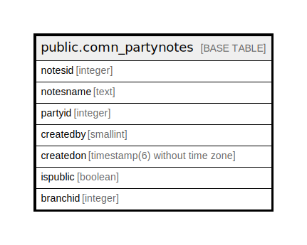

# public.comn_partynotes

## Description

## Columns

| Name | Type | Default | Nullable | Children | Parents | Comment |
| ---- | ---- | ------- | -------- | -------- | ------- | ------- |
| notesid | integer | nextval('comn_partynotes_notesid_seq'::regclass) | false |  |  |  |
| notesname | text |  | false |  |  |  |
| partyid | integer |  | true |  |  |  |
| createdby | smallint |  | true |  |  |  |
| createdon | timestamp(6) without time zone | now() | true |  |  |  |
| ispublic | boolean | false | false |  |  |  |
| branchid | integer |  | true |  |  |  |

## Relations

---

> Generated by [tbls](https://github.com/k1LoW/tbls)
