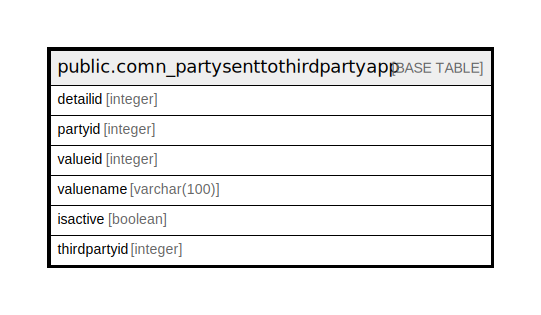

# public.comn_partysenttothirdpartyapp

## Description

## Columns

| Name | Type | Default | Nullable | Children | Parents | Comment |
| ---- | ---- | ------- | -------- | -------- | ------- | ------- |
| detailid | integer | nextval('comn_partysenttothirdpartyapp_detailid_seq'::regclass) | false |  |  |  |
| partyid | integer |  | true |  |  |  |
| valueid | integer |  | true |  |  |  |
| valuename | varchar(100) |  | true |  |  |  |
| isactive | boolean |  | true |  |  |  |
| thirdpartyid | integer | 0 | true |  |  |  |

## Constraints

| Name | Type | Definition |
| ---- | ---- | ---------- |
| comn_partysenttothirdpartyapp_pkey | PRIMARY KEY | PRIMARY KEY (detailid) |

## Indexes

| Name | Definition |
| ---- | ---------- |
| comn_partysenttothirdpartyapp_pkey | CREATE UNIQUE INDEX comn_partysenttothirdpartyapp_pkey ON public.comn_partysenttothirdpartyapp USING btree (detailid) |

## Relations

---

> Generated by [tbls](https://github.com/k1LoW/tbls)
