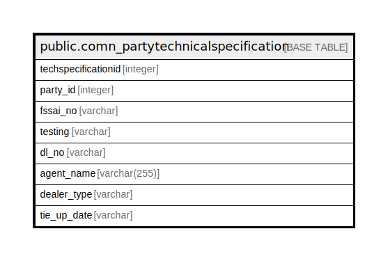

# public.comn_partytechnicalspecification

## Description

## Columns

| Name | Type | Default | Nullable | Children | Parents | Comment |
| ---- | ---- | ------- | -------- | -------- | ------- | ------- |
| techspecificationid | integer | nextval('comn_partytechnicalspecification_techspecificationid_seq'::regclass) | false |  |  |  |
| party_id | integer |  | true |  |  |  |
| fssai_no | varchar |  | true |  |  |  |
| testing | varchar |  | true |  |  |  |
| dl_no | varchar |  | true |  |  |  |
| agent_name | varchar(255) |  | true |  |  |  |
| dealer_type | varchar |  | true |  |  |  |
| tie_up_date | varchar |  | true |  |  |  |

## Constraints

| Name | Type | Definition |
| ---- | ---- | ---------- |
| comn_partytechnicalspecification_pkey | PRIMARY KEY | PRIMARY KEY (techspecificationid) |

## Indexes

| Name | Definition |
| ---- | ---------- |
| comn_partytechnicalspecification_pkey | CREATE UNIQUE INDEX comn_partytechnicalspecification_pkey ON public.comn_partytechnicalspecification USING btree (techspecificationid) |

## Relations

---

> Generated by [tbls](https://github.com/k1LoW/tbls)
