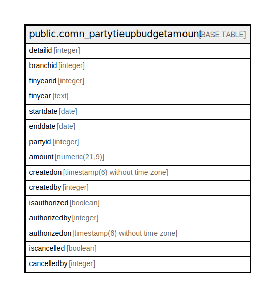

# public.comn_partytieupbudgetamount

## Description

## Columns

| Name | Type | Default | Nullable | Children | Parents | Comment |
| ---- | ---- | ------- | -------- | -------- | ------- | ------- |
| detailid | integer | nextval('comn_partytieupbudgetamount_detailid_seq'::regclass) | false |  |  |  |
| branchid | integer |  | true |  |  |  |
| finyearid | integer |  | true |  |  |  |
| finyear | text |  | true |  |  |  |
| startdate | date |  | true |  |  |  |
| enddate | date |  | true |  |  |  |
| partyid | integer |  | true |  |  |  |
| amount | numeric(21,9) |  | true |  |  |  |
| createdon | timestamp(6) without time zone | now() | true |  |  |  |
| createdby | integer |  | true |  |  |  |
| isauthorized | boolean | false | true |  |  |  |
| authorizedby | integer |  | true |  |  |  |
| authorizedon | timestamp(6) without time zone | now() | true |  |  |  |
| iscancelled | boolean | false | true |  |  |  |
| cancelledby | integer |  | true |  |  |  |

## Constraints

| Name | Type | Definition |
| ---- | ---- | ---------- |
| pkey_comn_partytieupbudgetamount | PRIMARY KEY | PRIMARY KEY (detailid) |

## Indexes

| Name | Definition |
| ---- | ---------- |
| pkey_comn_partytieupbudgetamount | CREATE UNIQUE INDEX pkey_comn_partytieupbudgetamount ON public.comn_partytieupbudgetamount USING btree (detailid) |

## Relations

---

> Generated by [tbls](https://github.com/k1LoW/tbls)
