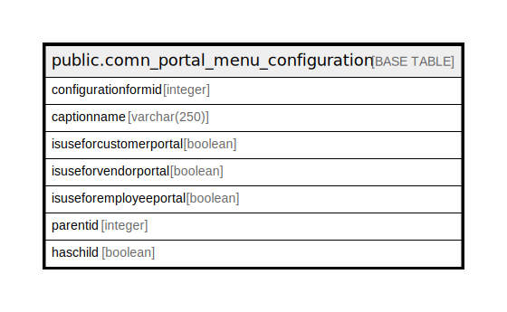

# public.comn_portal_menu_configuration

## Description

## Columns

| Name | Type | Default | Nullable | Children | Parents | Comment |
| ---- | ---- | ------- | -------- | -------- | ------- | ------- |
| configurationformid | integer |  | false |  |  |  |
| captionname | varchar(250) |  | true |  |  |  |
| isuseforcustomerportal | boolean | false | false |  |  |  |
| isuseforvendorportal | boolean | false | false |  |  |  |
| isuseforemployeeportal | boolean | false | false |  |  |  |
| parentid | integer | 0 | false |  |  |  |
| haschild | boolean | false | false |  |  |  |

## Constraints

| Name | Type | Definition |
| ---- | ---- | ---------- |
| comn_portal_menu_configuration_pkey | PRIMARY KEY | PRIMARY KEY (configurationformid) |

## Indexes

| Name | Definition |
| ---- | ---------- |
| comn_portal_menu_configuration_pkey | CREATE UNIQUE INDEX comn_portal_menu_configuration_pkey ON public.comn_portal_menu_configuration USING btree (configurationformid) |

## Relations

---

> Generated by [tbls](https://github.com/k1LoW/tbls)
