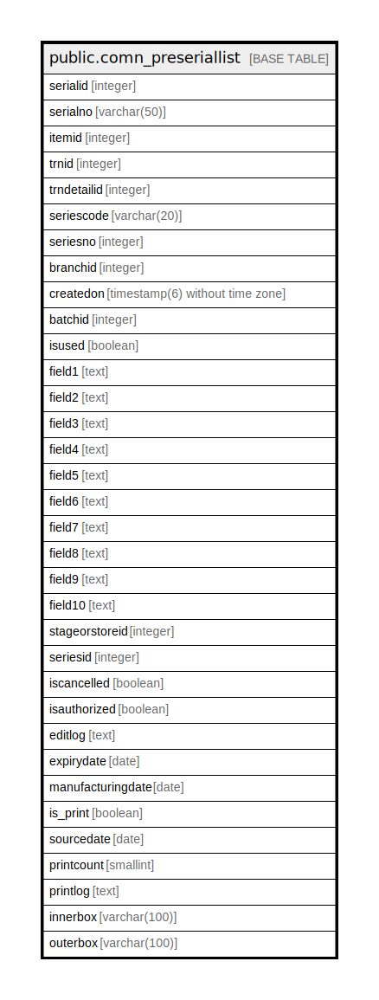

# public.comn_preseriallist

## Description

## Columns

| Name | Type | Default | Nullable | Children | Parents | Comment |
| ---- | ---- | ------- | -------- | -------- | ------- | ------- |
| serialid | integer | nextval('comn_preseriallist_serialid_seq'::regclass) | false |  |  |  |
| serialno | varchar(50) |  | true |  |  |  |
| itemid | integer |  | true |  |  |  |
| trnid | integer |  | true |  |  |  |
| trndetailid | integer |  | true |  |  |  |
| seriescode | varchar(20) |  | true |  |  |  |
| seriesno | integer |  | true |  |  |  |
| branchid | integer |  | true |  |  |  |
| createdon | timestamp(6) without time zone | now() | true |  |  |  |
| batchid | integer |  | true |  |  |  |
| isused | boolean | false | true |  |  |  |
| field1 | text |  | true |  |  |  |
| field2 | text |  | true |  |  |  |
| field3 | text |  | true |  |  |  |
| field4 | text |  | true |  |  |  |
| field5 | text |  | true |  |  |  |
| field6 | text |  | true |  |  |  |
| field7 | text |  | true |  |  |  |
| field8 | text |  | true |  |  |  |
| field9 | text |  | true |  |  |  |
| field10 | text |  | true |  |  |  |
| stageorstoreid | integer |  | true |  |  |  |
| seriesid | integer |  | true |  |  |  |
| iscancelled | boolean | false | true |  |  |  |
| isauthorized | boolean | false | true |  |  |  |
| editlog | text |  | true |  |  |  |
| expirydate | date |  | true |  |  |  |
| manufacturingdate | date |  | true |  |  |  |
| is_print | boolean | false | true |  |  |  |
| sourcedate | date |  | true |  |  |  |
| printcount | smallint |  | true |  |  |  |
| printlog | text |  | true |  |  |  |
| innerbox | varchar(100) |  | true |  |  |  |
| outerbox | varchar(100) |  | true |  |  |  |

## Constraints

| Name | Type | Definition |
| ---- | ---- | ---------- |
| comn_preseriallist_pkey | PRIMARY KEY | PRIMARY KEY (serialid) |

## Indexes

| Name | Definition |
| ---- | ---------- |
| comn_preseriallist_pkey | CREATE UNIQUE INDEX comn_preseriallist_pkey ON public.comn_preseriallist USING btree (serialid) |

## Triggers

| Name | Definition |
| ---- | ---------- |
| trg_addrandomserial | CREATE TRIGGER trg_addrandomserial BEFORE INSERT ON public.comn_preseriallist FOR EACH ROW EXECUTE FUNCTION trg_fun_addrandomserial() |

## Relations

---

> Generated by [tbls](https://github.com/k1LoW/tbls)
