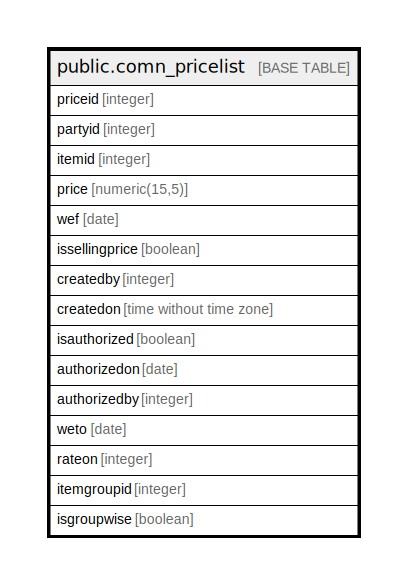

# public.comn_pricelist

## Description

## Columns

| Name | Type | Default | Nullable | Children | Parents | Comment |
| ---- | ---- | ------- | -------- | -------- | ------- | ------- |
| priceid | integer | nextval('comn_pricelist_priceid_seq'::regclass) | false |  |  |  |
| partyid | integer |  | true |  |  |  |
| itemid | integer |  | true |  |  |  |
| price | numeric(15,5) |  | true |  |  |  |
| wef | date |  | true |  |  |  |
| issellingprice | boolean |  | true |  |  |  |
| createdby | integer |  | true |  |  |  |
| createdon | time without time zone | now() | true |  |  |  |
| isauthorized | boolean | false | true |  |  |  |
| authorizedon | date |  | true |  |  |  |
| authorizedby | integer | 0 | true |  |  |  |
| weto | date |  | true |  |  |  |
| rateon | integer | 0 | true |  |  |  |
| itemgroupid | integer |  | true |  |  |  |
| isgroupwise | boolean | false | true |  |  |  |

## Constraints

| Name | Type | Definition |
| ---- | ---- | ---------- |
| comn_pricelist_pkey | PRIMARY KEY | PRIMARY KEY (priceid) |

## Indexes

| Name | Definition |
| ---- | ---------- |
| comn_pricelist_pkey | CREATE UNIQUE INDEX comn_pricelist_pkey ON public.comn_pricelist USING btree (priceid) |

## Relations

---

> Generated by [tbls](https://github.com/k1LoW/tbls)
