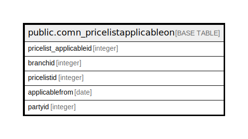

# public.comn_pricelistapplicableon

## Description

## Columns

| Name | Type | Default | Nullable | Children | Parents | Comment |
| ---- | ---- | ------- | -------- | -------- | ------- | ------- |
| pricelist_applicableid | integer | nextval('comn_pricelistapplicableon_pricelist_applicableid_seq'::regclass) | false |  |  |  |
| branchid | integer |  | true |  |  |  |
| pricelistid | integer |  | true |  |  |  |
| applicablefrom | date |  | true |  |  |  |
| partyid | integer |  | true |  |  |  |

## Constraints

| Name | Type | Definition |
| ---- | ---- | ---------- |
| comn_pricelistapplicableon_pkey | PRIMARY KEY | PRIMARY KEY (pricelist_applicableid) |

## Indexes

| Name | Definition |
| ---- | ---------- |
| comn_pricelistapplicableon_pkey | CREATE UNIQUE INDEX comn_pricelistapplicableon_pkey ON public.comn_pricelistapplicableon USING btree (pricelist_applicableid) |

## Relations

---

> Generated by [tbls](https://github.com/k1LoW/tbls)
