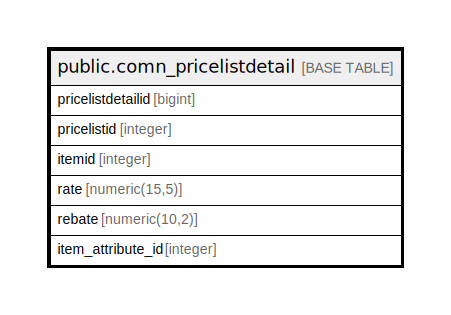

# public.comn_pricelistdetail

## Description

## Columns

| Name | Type | Default | Nullable | Children | Parents | Comment |
| ---- | ---- | ------- | -------- | -------- | ------- | ------- |
| pricelistdetailid | bigint | nextval('comn_pricelistdetail_pricelistdetailid_seq'::regclass) | false |  |  |  |
| pricelistid | integer |  | true |  |  |  |
| itemid | integer |  | true |  |  |  |
| rate | numeric(15,5) | 0 | true |  |  |  |
| rebate | numeric(10,2) | 0 | true |  |  |  |
| item_attribute_id | integer |  | true |  |  |  |

## Constraints

| Name | Type | Definition |
| ---- | ---- | ---------- |
| comn_pricelistdetail_pkey | PRIMARY KEY | PRIMARY KEY (pricelistdetailid) |

## Indexes

| Name | Definition |
| ---- | ---------- |
| comn_pricelistdetail_pkey | CREATE UNIQUE INDEX comn_pricelistdetail_pkey ON public.comn_pricelistdetail USING btree (pricelistdetailid) |

## Triggers

| Name | Definition |
| ---- | ---------- |
| pricelist_amend_log_entry | CREATE TRIGGER pricelist_amend_log_entry BEFORE UPDATE ON public.comn_pricelistdetail FOR EACH ROW EXECUTE FUNCTION pricelist_amend_log_entry() |

## Relations

---

> Generated by [tbls](https://github.com/k1LoW/tbls)
