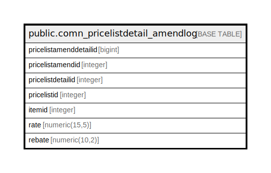

# public.comn_pricelistdetail_amendlog

## Description

## Columns

| Name | Type | Default | Nullable | Children | Parents | Comment |
| ---- | ---- | ------- | -------- | -------- | ------- | ------- |
| pricelistamenddetailid | bigint | nextval('comn_pricelistdetail_amendlog_pricelistamenddetailid_seq'::regclass) | false |  |  |  |
| pricelistamendid | integer |  | true |  |  |  |
| pricelistdetailid | integer |  | true |  |  |  |
| pricelistid | integer |  | true |  |  |  |
| itemid | integer |  | true |  |  |  |
| rate | numeric(15,5) | 0 | true |  |  |  |
| rebate | numeric(10,2) | 0 | true |  |  |  |

## Constraints

| Name | Type | Definition |
| ---- | ---- | ---------- |
| comn_pricelistdetail_amendlog_pkey | PRIMARY KEY | PRIMARY KEY (pricelistamenddetailid) |

## Indexes

| Name | Definition |
| ---- | ---------- |
| comn_pricelistdetail_amendlog_pkey | CREATE UNIQUE INDEX comn_pricelistdetail_amendlog_pkey ON public.comn_pricelistdetail_amendlog USING btree (pricelistamenddetailid) |

## Relations

---

> Generated by [tbls](https://github.com/k1LoW/tbls)
