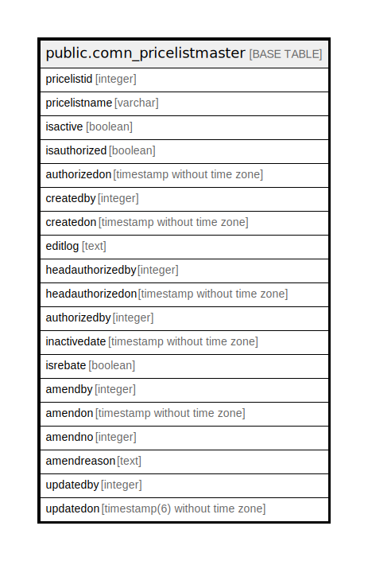

# public.comn_pricelistmaster

## Description

## Columns

| Name | Type | Default | Nullable | Children | Parents | Comment |
| ---- | ---- | ------- | -------- | -------- | ------- | ------- |
| pricelistid | integer | nextval('comn_pricelistmaster_pricelistid_seq'::regclass) | false |  |  |  |
| pricelistname | varchar |  | true |  |  |  |
| isactive | boolean |  | true |  |  |  |
| isauthorized | boolean |  | true |  |  |  |
| authorizedon | timestamp without time zone |  | true |  |  |  |
| createdby | integer |  | true |  |  |  |
| createdon | timestamp without time zone | now() | true |  |  |  |
| editlog | text |  | true |  |  |  |
| headauthorizedby | integer |  | true |  |  |  |
| headauthorizedon | timestamp without time zone |  | true |  |  |  |
| authorizedby | integer |  | true |  |  |  |
| inactivedate | timestamp without time zone |  | true |  |  |  |
| isrebate | boolean | false | true |  |  |  |
| amendby | integer |  | true |  |  |  |
| amendon | timestamp without time zone |  | true |  |  |  |
| amendno | integer |  | true |  |  |  |
| amendreason | text |  | true |  |  |  |
| updatedby | integer |  | true |  |  |  |
| updatedon | timestamp(6) without time zone | NULL::timestamp without time zone | true |  |  |  |

## Constraints

| Name | Type | Definition |
| ---- | ---- | ---------- |
| comn_pricelistmaster_pkey | PRIMARY KEY | PRIMARY KEY (pricelistid) |

## Indexes

| Name | Definition |
| ---- | ---------- |
| comn_pricelistmaster_pkey | CREATE UNIQUE INDEX comn_pricelistmaster_pkey ON public.comn_pricelistmaster USING btree (pricelistid) |
| unique_pricelistname | CREATE UNIQUE INDEX unique_pricelistname ON public.comn_pricelistmaster USING btree (lower((pricelistname)::text)) |

## Triggers

| Name | Definition |
| ---- | ---------- |
| pricelist_amend_log_entry | CREATE TRIGGER pricelist_amend_log_entry BEFORE UPDATE ON public.comn_pricelistmaster FOR EACH ROW EXECUTE FUNCTION pricelist_amend_log_entry() |

## Relations

---

> Generated by [tbls](https://github.com/k1LoW/tbls)
