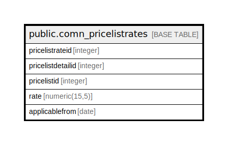

# public.comn_pricelistrates

## Description

## Columns

| Name | Type | Default | Nullable | Children | Parents | Comment |
| ---- | ---- | ------- | -------- | -------- | ------- | ------- |
| pricelistrateid | integer | nextval('comn_pricelistrates_pricelistrateid_seq'::regclass) | false |  |  |  |
| pricelistdetailid | integer |  | true |  |  |  |
| pricelistid | integer |  | true |  |  |  |
| rate | numeric(15,5) |  | true |  |  |  |
| applicablefrom | date |  | true |  |  |  |

## Constraints

| Name | Type | Definition |
| ---- | ---- | ---------- |
| comn_pricelistrates_pkey | PRIMARY KEY | PRIMARY KEY (pricelistrateid) |

## Indexes

| Name | Definition |
| ---- | ---------- |
| comn_pricelistrates_pkey | CREATE UNIQUE INDEX comn_pricelistrates_pkey ON public.comn_pricelistrates USING btree (pricelistrateid) |

## Triggers

| Name | Definition |
| ---- | ---------- |
| pricelist_amend_log_entry | CREATE TRIGGER pricelist_amend_log_entry BEFORE UPDATE ON public.comn_pricelistrates FOR EACH ROW EXECUTE FUNCTION pricelist_amend_log_entry() |

## Relations

---

> Generated by [tbls](https://github.com/k1LoW/tbls)
