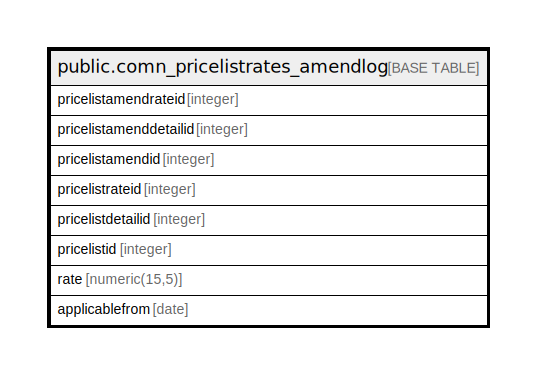

# public.comn_pricelistrates_amendlog

## Description

## Columns

| Name | Type | Default | Nullable | Children | Parents | Comment |
| ---- | ---- | ------- | -------- | -------- | ------- | ------- |
| pricelistamendrateid | integer | nextval('comn_pricelistrates_amendlog_pricelistamendrateid_seq'::regclass) | false |  |  |  |
| pricelistamenddetailid | integer |  | true |  |  |  |
| pricelistamendid | integer |  | true |  |  |  |
| pricelistrateid | integer |  | true |  |  |  |
| pricelistdetailid | integer |  | true |  |  |  |
| pricelistid | integer |  | true |  |  |  |
| rate | numeric(15,5) |  | true |  |  |  |
| applicablefrom | date |  | true |  |  |  |

## Constraints

| Name | Type | Definition |
| ---- | ---- | ---------- |
| comn_pricelistrates_amendlog_pkey | PRIMARY KEY | PRIMARY KEY (pricelistamendrateid) |

## Indexes

| Name | Definition |
| ---- | ---------- |
| comn_pricelistrates_amendlog_pkey | CREATE UNIQUE INDEX comn_pricelistrates_amendlog_pkey ON public.comn_pricelistrates_amendlog USING btree (pricelistamendrateid) |

## Relations

---

> Generated by [tbls](https://github.com/k1LoW/tbls)
