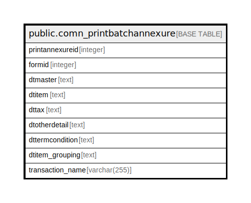

# public.comn_printbatchannexure

## Description

## Columns

| Name | Type | Default | Nullable | Children | Parents | Comment |
| ---- | ---- | ------- | -------- | -------- | ------- | ------- |
| printannexureid | integer | nextval('comn_printbatchannexure_printannexureid_seq'::regclass) | false |  |  |  |
| formid | integer |  | true |  |  |  |
| dtmaster | text |  | true |  |  |  |
| dtitem | text |  | true |  |  |  |
| dttax | text |  | true |  |  |  |
| dtotherdetail | text |  | true |  |  |  |
| dttermcondition | text |  | true |  |  |  |
| dtitem_grouping | text |  | true |  |  |  |
| transaction_name | varchar(255) |  | true |  |  |  |

## Constraints

| Name | Type | Definition |
| ---- | ---- | ---------- |
| comn_printbatchannexure_pkey | PRIMARY KEY | PRIMARY KEY (printannexureid) |

## Indexes

| Name | Definition |
| ---- | ---------- |
| comn_printbatchannexure_pkey | CREATE UNIQUE INDEX comn_printbatchannexure_pkey ON public.comn_printbatchannexure USING btree (printannexureid) |

## Relations

---

> Generated by [tbls](https://github.com/k1LoW/tbls)
