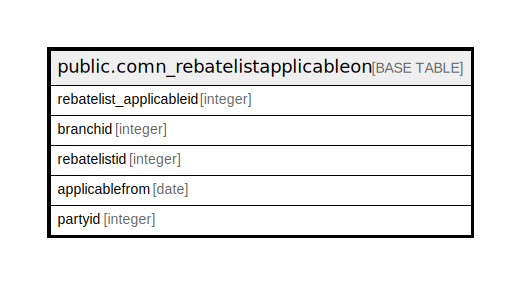

# public.comn_rebatelistapplicableon

## Description

## Columns

| Name | Type | Default | Nullable | Children | Parents | Comment |
| ---- | ---- | ------- | -------- | -------- | ------- | ------- |
| rebatelist_applicableid | integer | nextval('comn_rebatelistapplicableon_rebatelist_applicableid_seq'::regclass) | false |  |  |  |
| branchid | integer |  | true |  |  |  |
| rebatelistid | integer |  | true |  |  |  |
| applicablefrom | date |  | true |  |  |  |
| partyid | integer |  | true |  |  |  |

## Constraints

| Name | Type | Definition |
| ---- | ---- | ---------- |
| comn_rebatelistapplicableon_pkey | PRIMARY KEY | PRIMARY KEY (rebatelist_applicableid) |

## Indexes

| Name | Definition |
| ---- | ---------- |
| comn_rebatelistapplicableon_pkey | CREATE UNIQUE INDEX comn_rebatelistapplicableon_pkey ON public.comn_rebatelistapplicableon USING btree (rebatelist_applicableid) |

## Relations

---

> Generated by [tbls](https://github.com/k1LoW/tbls)
