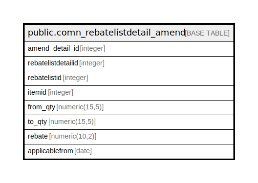

# public.comn_rebatelistdetail_amend

## Description

## Columns

| Name | Type | Default | Nullable | Children | Parents | Comment |
| ---- | ---- | ------- | -------- | -------- | ------- | ------- |
| amend_detail_id | integer | nextval('comn_rebatelistdetail_amend_amend_detail_id_seq'::regclass) | false |  |  |  |
| rebatelistdetailid | integer |  | true |  |  |  |
| rebatelistid | integer |  | true |  |  |  |
| itemid | integer |  | true |  |  |  |
| from_qty | numeric(15,5) | 0 | true |  |  |  |
| to_qty | numeric(15,5) | 0 | true |  |  |  |
| rebate | numeric(10,2) | 0 | true |  |  |  |
| applicablefrom | date |  | true |  |  |  |

## Constraints

| Name | Type | Definition |
| ---- | ---- | ---------- |
| comn_rebatelistdetail_amend_pkey | PRIMARY KEY | PRIMARY KEY (amend_detail_id) |

## Indexes

| Name | Definition |
| ---- | ---------- |
| comn_rebatelistdetail_amend_pkey | CREATE UNIQUE INDEX comn_rebatelistdetail_amend_pkey ON public.comn_rebatelistdetail_amend USING btree (amend_detail_id) |

## Relations

---

> Generated by [tbls](https://github.com/k1LoW/tbls)
