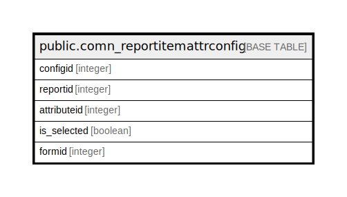

# public.comn_reportitemattrconfig

## Description

## Columns

| Name | Type | Default | Nullable | Children | Parents | Comment |
| ---- | ---- | ------- | -------- | -------- | ------- | ------- |
| configid | integer | nextval('comn_reportitemattrconfig_configid_seq'::regclass) | false |  |  |  |
| reportid | integer |  | true |  |  |  |
| attributeid | integer |  | true |  |  |  |
| is_selected | boolean |  | true |  |  |  |
| formid | integer |  | true |  |  |  |

## Relations

---

> Generated by [tbls](https://github.com/k1LoW/tbls)
