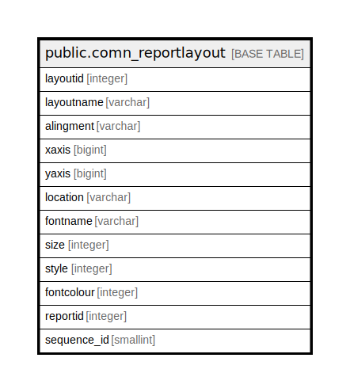

# public.comn_reportlayout

## Description

## Columns

| Name | Type | Default | Nullable | Children | Parents | Comment |
| ---- | ---- | ------- | -------- | -------- | ------- | ------- |
| layoutid | integer | nextval('comn_reportlayout_layoutid_seq'::regclass) | false |  |  |  |
| layoutname | varchar |  | true |  |  |  |
| alingment | varchar |  | true |  |  |  |
| xaxis | bigint |  | true |  |  |  |
| yaxis | bigint |  | true |  |  |  |
| location | varchar |  | true |  |  |  |
| fontname | varchar | 'Times New Roman'::character varying | true |  |  |  |
| size | integer | 10 | true |  |  |  |
| style | integer | 3 | true |  |  |  |
| fontcolour | integer | '-16777216'::integer | true |  |  |  |
| reportid | integer |  | true |  |  |  |
| sequence_id | smallint |  | true |  |  |  |

## Constraints

| Name | Type | Definition |
| ---- | ---- | ---------- |
| comn_reportlayout_pkey | PRIMARY KEY | PRIMARY KEY (layoutid) |

## Indexes

| Name | Definition |
| ---- | ---------- |
| comn_reportlayout_pkey | CREATE UNIQUE INDEX comn_reportlayout_pkey ON public.comn_reportlayout USING btree (layoutid) |

## Relations

---

> Generated by [tbls](https://github.com/k1LoW/tbls)
