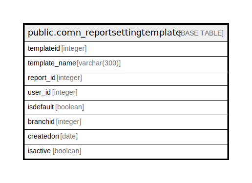

# public.comn_reportsettingtemplate

## Description

## Columns

| Name | Type | Default | Nullable | Children | Parents | Comment |
| ---- | ---- | ------- | -------- | -------- | ------- | ------- |
| templateid | integer | nextval('comn_reportsettingtemplate_templateid_seq'::regclass) | false |  |  |  |
| template_name | varchar(300) |  | true |  |  |  |
| report_id | integer |  | true |  |  |  |
| user_id | integer |  | true |  |  |  |
| isdefault | boolean | false | true |  |  |  |
| branchid | integer |  | true |  |  |  |
| createdon | date |  | true |  |  |  |
| isactive | boolean | false | true |  |  |  |

## Constraints

| Name | Type | Definition |
| ---- | ---- | ---------- |
| comn_reportsettingtemplate_pkey | PRIMARY KEY | PRIMARY KEY (templateid) |

## Indexes

| Name | Definition |
| ---- | ---------- |
| comn_reportsettingtemplate_pkey | CREATE UNIQUE INDEX comn_reportsettingtemplate_pkey ON public.comn_reportsettingtemplate USING btree (templateid) |

## Relations

---

> Generated by [tbls](https://github.com/k1LoW/tbls)
