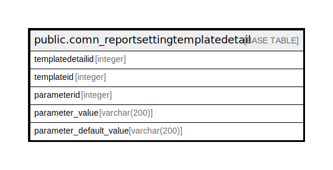

# public.comn_reportsettingtemplatedetail

## Description

## Columns

| Name | Type | Default | Nullable | Children | Parents | Comment |
| ---- | ---- | ------- | -------- | -------- | ------- | ------- |
| templatedetailid | integer | nextval('comn_reportsettingtemplatedetail_templatedetailid_seq'::regclass) | false |  |  |  |
| templateid | integer |  | true |  |  |  |
| parameterid | integer |  | true |  |  |  |
| parameter_value | varchar(200) |  | true |  |  |  |
| parameter_default_value | varchar(200) |  | true |  |  |  |

## Constraints

| Name | Type | Definition |
| ---- | ---- | ---------- |
| comn_reportsettingtemplatedetail_pkey | PRIMARY KEY | PRIMARY KEY (templatedetailid) |

## Indexes

| Name | Definition |
| ---- | ---------- |
| comn_reportsettingtemplatedetail_pkey | CREATE UNIQUE INDEX comn_reportsettingtemplatedetail_pkey ON public.comn_reportsettingtemplatedetail USING btree (templatedetailid) |

## Relations

---

> Generated by [tbls](https://github.com/k1LoW/tbls)
