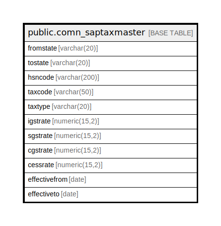

# public.comn_saptaxmaster

## Description

## Columns

| Name | Type | Default | Nullable | Children | Parents | Comment |
| ---- | ---- | ------- | -------- | -------- | ------- | ------- |
| fromstate | varchar(20) | ''::character varying | false |  |  |  |
| tostate | varchar(20) | ''::character varying | false |  |  |  |
| hsncode | varchar(200) |  | false |  |  |  |
| taxcode | varchar(50) | ''::character varying | false |  |  |  |
| taxtype | varchar(20) | ''::character varying | false |  |  |  |
| igstrate | numeric(15,2) | 0 | false |  |  |  |
| sgstrate | numeric(15,2) | 0 | false |  |  |  |
| cgstrate | numeric(15,2) | 0 | false |  |  |  |
| cessrate | numeric(15,2) | 0 | false |  |  |  |
| effectivefrom | date |  | true |  |  |  |
| effectiveto | date |  | true |  |  |  |

## Relations

---

> Generated by [tbls](https://github.com/k1LoW/tbls)
