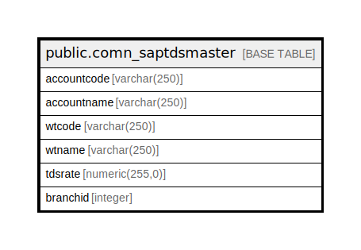

# public.comn_saptdsmaster

## Description

## Columns

| Name | Type | Default | Nullable | Children | Parents | Comment |
| ---- | ---- | ------- | -------- | -------- | ------- | ------- |
| accountcode | varchar(250) |  | true |  |  |  |
| accountname | varchar(250) |  | true |  |  |  |
| wtcode | varchar(250) |  | true |  |  |  |
| wtname | varchar(250) |  | true |  |  |  |
| tdsrate | numeric(255,0) |  | true |  |  |  |
| branchid | integer |  | true |  |  |  |

## Relations

---

> Generated by [tbls](https://github.com/k1LoW/tbls)
