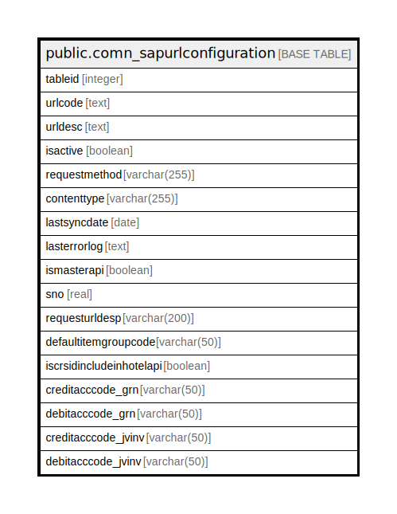

# public.comn_sapurlconfiguration

## Description

## Columns

| Name | Type | Default | Nullable | Children | Parents | Comment |
| ---- | ---- | ------- | -------- | -------- | ------- | ------- |
| tableid | integer |  | false |  |  |  |
| urlcode | text |  | true |  |  |  |
| urldesc | text |  | true |  |  |  |
| isactive | boolean | true | true |  |  |  |
| requestmethod | varchar(255) |  | true |  |  |  |
| contenttype | varchar(255) |  | true |  |  |  |
| lastsyncdate | date |  | true |  |  |  |
| lasterrorlog | text |  | true |  |  |  |
| ismasterapi | boolean |  | true |  |  |  |
| sno | real | 0 | false |  |  |  |
| requesturldesp | varchar(200) | ''::character varying | false |  |  |  |
| defaultitemgroupcode | varchar(50) | ''::character varying | false |  |  |  |
| iscrsidincludeinhotelapi | boolean | false | false |  |  |  |
| creditacccode_grn | varchar(50) | ''::character varying | true |  |  |  |
| debitacccode_grn | varchar(50) | ''::character varying | true |  |  |  |
| creditacccode_jvinv | varchar(50) | ''::character varying | true |  |  |  |
| debitacccode_jvinv | varchar(50) | ''::character varying | true |  |  |  |

## Constraints

| Name | Type | Definition |
| ---- | ---- | ---------- |
| comn_sapurlconfiguration_tableid | PRIMARY KEY | PRIMARY KEY (tableid) |

## Indexes

| Name | Definition |
| ---- | ---------- |
| comn_sapurlconfiguration_tableid | CREATE UNIQUE INDEX comn_sapurlconfiguration_tableid ON public.comn_sapurlconfiguration USING btree (tableid) |

## Relations

---

> Generated by [tbls](https://github.com/k1LoW/tbls)
