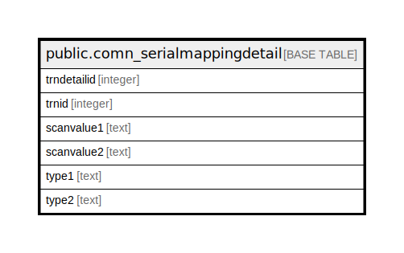

# public.comn_serialmappingdetail

## Description

## Columns

| Name | Type | Default | Nullable | Children | Parents | Comment |
| ---- | ---- | ------- | -------- | -------- | ------- | ------- |
| trndetailid | integer | nextval('comn_serialmappingdetail_trndetailid_seq'::regclass) | false |  |  |  |
| trnid | integer |  | true |  |  |  |
| scanvalue1 | text |  | true |  |  |  |
| scanvalue2 | text |  | true |  |  |  |
| type1 | text |  | true |  |  |  |
| type2 | text |  | true |  |  |  |

## Constraints

| Name | Type | Definition |
| ---- | ---- | ---------- |
| comn_serialmappingdetail_pkey | PRIMARY KEY | PRIMARY KEY (trndetailid) |

## Indexes

| Name | Definition |
| ---- | ---------- |
| comn_serialmappingdetail_pkey | CREATE UNIQUE INDEX comn_serialmappingdetail_pkey ON public.comn_serialmappingdetail USING btree (trndetailid) |

## Relations

---

> Generated by [tbls](https://github.com/k1LoW/tbls)
