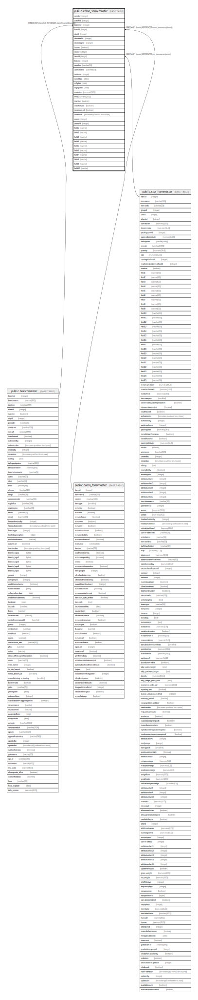

# public.comn_serialmaster

## Description

New Serial will create in this table. each transaction time get update.

## Columns

| Name | Type | Default | Nullable | Children | Parents | Comment |
| ---- | ---- | ------- | -------- | -------- | ------- | ------- |
| serialid | integer | nextval('seq_serialid'::regclass) | false |  |  |  |
| cuttoffid | integer | 0 | false |  |  |  |
| branchid | integer |  | false |  | [public.branchmaster](public.branchmaster.md) |  |
| formid | integer |  | false |  | [public.comn_formmaster](public.comn_formmaster.md) | From which form serial created. |
| docid | integer |  | false |  |  | Summary table Id of serial created transaction. |
| docdetailid | integer |  | false |  |  | Item Detail table Id of serial created transaction. |
| storestageid | integer |  | false |  |  | Current Store or Stage Id. |
| isstore | boolean |  | false |  |  | Current Store=true or Stage=false. |
| rackid | integer |  | false |  |  |  |
| itemid | integer |  | false |  | [public.stor_itemmaster](public.stor_itemmaster.md) |  |
| batchid | integer |  | false |  |  |  |
| serialno | varchar(50) |  | false |  |  |  |
| userserialno | varchar(50) |  | false |  |  |  |
| seriesno | integer |  | false |  |  |  |
| serialdate | date |  | false |  |  |  |
| mfgdate | date |  | false |  |  |  |
| expirydate | date |  | false |  |  |  |
| costprice | numeric(18,5) | 0 | true |  |  | Serial inward cost. |
| mrp | numeric(18,5) | 0 | true |  |  |  |
| isactive | boolean | true | true |  |  |  |
| isauthorized | boolean | false | true |  |  |  |
| isconsumed | boolean | false | true |  |  |  |
| createdon | timestamp without time zone | now() | false |  |  |  |
| userid | integer |  | false |  |  |  |
| seriesid | integer | 0 | false |  |  | based on series will be applied and its optinal |
| field1 | varchar |  | true |  |  |  |
| field2 | varchar |  | true |  |  |  |
| field3 | varchar |  | true |  |  |  |
| field4 | varchar |  | true |  |  |  |
| field5 | varchar |  | true |  |  |  |
| field6 | varchar |  | true |  |  |  |
| field7 | varchar |  | true |  |  |  |
| field8 | varchar |  | true |  |  |  |
| field9 | varchar |  | true |  |  |  |
| field10 | varchar |  | true |  |  |  |

## Constraints

| Name | Type | Definition |
| ---- | ---- | ---------- |
| comn_serialmaster_branchid_fkey | FOREIGN KEY | FOREIGN KEY (branchid) REFERENCES branchmaster(branchid) |
| comn_serialmaster_pkey | PRIMARY KEY | PRIMARY KEY (branchid, formid, docid, docdetailid, itemid, serialno) |
| comn_serialmaster_serialid_key | UNIQUE | UNIQUE (serialid) |
| comn_serialmaster_formid_fkey | FOREIGN KEY | FOREIGN KEY (formid) REFERENCES comn_formmaster(formid) |
| comn_serialmaster_itemid_fkey | FOREIGN KEY | FOREIGN KEY (itemid) REFERENCES stor_itemmaster(itemid) |

## Indexes

| Name | Definition |
| ---- | ---------- |
| comn_serialmaster_pkey | CREATE UNIQUE INDEX comn_serialmaster_pkey ON public.comn_serialmaster USING btree (branchid, formid, docid, docdetailid, itemid, serialno) |
| comn_serialmaster_serialid_key | CREATE UNIQUE INDEX comn_serialmaster_serialid_key ON public.comn_serialmaster USING btree (serialid) |
| ui_serialmast_serialno | CREATE UNIQUE INDEX ui_serialmast_serialno ON public.comn_serialmaster USING btree (branchid, itemid, serialno, isconsumed, isactive, createdon) |

## Triggers

| Name | Definition |
| ---- | ---------- |
| tgr_serialstocksave | CREATE TRIGGER tgr_serialstocksave AFTER INSERT OR DELETE OR UPDATE ON public.comn_serialmaster FOR EACH ROW EXECUTE FUNCTION fun_tgr_serialstocksave() |

## Relations

---

> Generated by [tbls](https://github.com/k1LoW/tbls)
