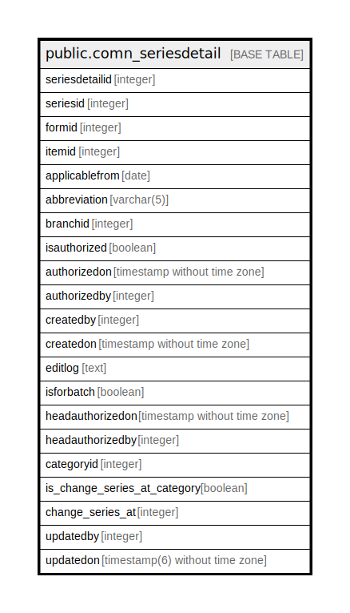

# public.comn_seriesdetail

## Description

## Columns

| Name | Type | Default | Nullable | Children | Parents | Comment |
| ---- | ---- | ------- | -------- | -------- | ------- | ------- |
| seriesdetailid | integer | nextval('comn_seriesdetail_seriesdetailid_seq'::regclass) | false |  |  |  |
| seriesid | integer |  | true |  |  |  |
| formid | integer |  | true |  |  |  |
| itemid | integer |  | true |  |  |  |
| applicablefrom | date |  | true |  |  |  |
| abbreviation | varchar(5) |  | true |  |  |  |
| branchid | integer |  | true |  |  |  |
| isauthorized | boolean | false | false |  |  |  |
| authorizedon | timestamp without time zone |  | true |  |  |  |
| authorizedby | integer |  | true |  |  |  |
| createdby | integer |  | true |  |  |  |
| createdon | timestamp without time zone | now() | true |  |  |  |
| editlog | text |  | true |  |  |  |
| isforbatch | boolean | true | true |  |  |  |
| headauthorizedon | timestamp without time zone |  | true |  |  |  |
| headauthorizedby | integer |  | true |  |  |  |
| categoryid | integer |  | true |  |  |  |
| is_change_series_at_category | boolean | false | true |  |  |  |
| change_series_at | integer |  | true |  |  |  |
| updatedby | integer |  | true |  |  |  |
| updatedon | timestamp(6) without time zone | NULL::timestamp without time zone | true |  |  |  |

## Constraints

| Name | Type | Definition |
| ---- | ---- | ---------- |
| comn_seriesdetail_pkey | PRIMARY KEY | PRIMARY KEY (seriesdetailid) |

## Indexes

| Name | Definition |
| ---- | ---------- |
| comn_seriesdetail_pkey | CREATE UNIQUE INDEX comn_seriesdetail_pkey ON public.comn_seriesdetail USING btree (seriesdetailid) |

## Triggers

| Name | Definition |
| ---- | ---------- |
| code_update_for_items_party | CREATE TRIGGER code_update_for_items_party AFTER INSERT OR UPDATE ON public.comn_seriesdetail FOR EACH ROW EXECUTE FUNCTION code_update_for_items_party() |

## Relations

---

> Generated by [tbls](https://github.com/k1LoW/tbls)
