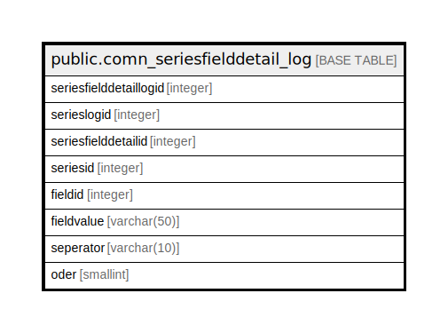

# public.comn_seriesfielddetail_log

## Description

## Columns

| Name | Type | Default | Nullable | Children | Parents | Comment |
| ---- | ---- | ------- | -------- | -------- | ------- | ------- |
| seriesfielddetaillogid | integer | nextval('comn_seriesfielddetail_log_seriesfielddetaillogid_seq'::regclass) | false |  |  |  |
| serieslogid | integer |  | true |  |  |  |
| seriesfielddetailid | integer |  | true |  |  |  |
| seriesid | integer |  | true |  |  |  |
| fieldid | integer |  | true |  |  |  |
| fieldvalue | varchar(50) |  | true |  |  |  |
| seperator | varchar(10) |  | true |  |  |  |
| oder | smallint |  | true |  |  |  |

## Relations

---

> Generated by [tbls](https://github.com/k1LoW/tbls)
