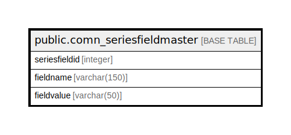

# public.comn_seriesfieldmaster

## Description

## Columns

| Name | Type | Default | Nullable | Children | Parents | Comment |
| ---- | ---- | ------- | -------- | -------- | ------- | ------- |
| seriesfieldid | integer |  | false |  |  |  |
| fieldname | varchar(150) |  | true |  |  |  |
| fieldvalue | varchar(50) |  | true |  |  |  |

## Constraints

| Name | Type | Definition |
| ---- | ---- | ---------- |
| comn_seriesfieldmaster_pkey | PRIMARY KEY | PRIMARY KEY (seriesfieldid) |

## Indexes

| Name | Definition |
| ---- | ---------- |
| comn_seriesfieldmaster_pkey | CREATE UNIQUE INDEX comn_seriesfieldmaster_pkey ON public.comn_seriesfieldmaster USING btree (seriesfieldid) |

## Relations

---

> Generated by [tbls](https://github.com/k1LoW/tbls)
