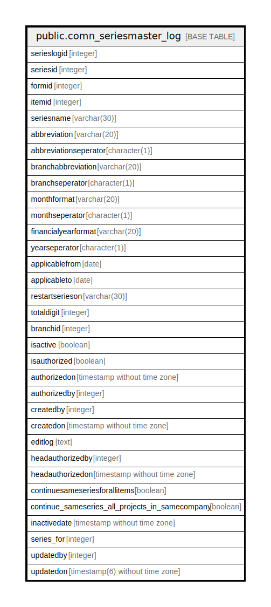

# public.comn_seriesmaster_log

## Description

## Columns

| Name | Type | Default | Nullable | Children | Parents | Comment |
| ---- | ---- | ------- | -------- | -------- | ------- | ------- |
| serieslogid | integer | nextval('comn_seriesmaster_log_serieslogid_seq'::regclass) | false |  |  |  |
| seriesid | integer |  | true |  |  |  |
| formid | integer |  | true |  |  |  |
| itemid | integer |  | true |  |  |  |
| seriesname | varchar(30) |  | true |  |  |  |
| abbreviation | varchar(20) |  | true |  |  |  |
| abbreviationseperator | character(1) |  | true |  |  |  |
| branchabbreviation | varchar(20) |  | true |  |  |  |
| branchseperator | character(1) |  | true |  |  |  |
| monthformat | varchar(20) |  | true |  |  |  |
| monthseperator | character(1) |  | true |  |  |  |
| financialyearformat | varchar(20) |  | true |  |  |  |
| yearseperator | character(1) |  | true |  |  |  |
| applicablefrom | date |  | true |  |  |  |
| applicableto | date |  | true |  |  |  |
| restartserieson | varchar(30) |  | true |  |  |  |
| totaldigit | integer | 1 | false |  |  |  |
| branchid | integer |  | true |  |  |  |
| isactive | boolean | false | false |  |  |  |
| isauthorized | boolean | false | false |  |  |  |
| authorizedon | timestamp without time zone |  | true |  |  |  |
| authorizedby | integer |  | true |  |  |  |
| createdby | integer |  | true |  |  |  |
| createdon | timestamp without time zone | now() | true |  |  |  |
| editlog | text |  | true |  |  |  |
| headauthorizedby | integer |  | true |  |  |  |
| headauthorizedon | timestamp without time zone |  | true |  |  |  |
| continuesameseriesforallitems | boolean | false | true |  |  |  |
| continue_sameseries_all_projects_in_samecompany | boolean | false | false |  |  |  |
| inactivedate | timestamp without time zone |  | true |  |  |  |
| series_for | integer | 0 | false |  |  |  |
| updatedby | integer |  | true |  |  |  |
| updatedon | timestamp(6) without time zone | NULL::timestamp without time zone | true |  |  |  |

## Relations

---

> Generated by [tbls](https://github.com/k1LoW/tbls)
