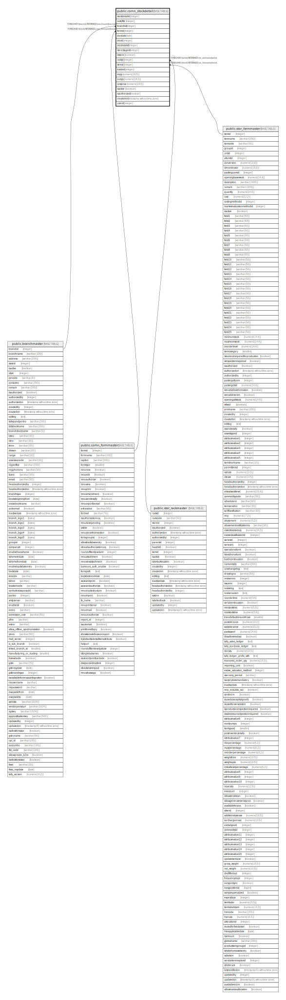

# public.comn_stockdetail

## Description

All stock transaction detail.

## Columns

| Name | Type | Default | Nullable | Children | Parents | Comment |
| ---- | ---- | ------- | -------- | -------- | ------- | ------- |
| stockdetailid | integer | nextval('seq_stockdetailid'::regclass) | false |  |  |  |
| cuttoffid | integer | 0 | false |  |  |  |
| branchid | integer |  | false |  | [public.branchmaster](public.branchmaster.md) |  |
| formid | integer |  | false |  | [public.comn_formmaster](public.comn_formmaster.md) | From which form record inserted. |
| docdate | date |  | false |  |  |  |
| docid | integer |  | false |  |  | Summary table Id. |
| docdetailid | integer |  | false |  |  | Item Detail table Id. |
| storestageid | integer |  | false |  |  | Store or Stage Id. |
| isstore | boolean |  | false |  |  | Store=true or Stage=false. |
| rackid | integer |  | false |  | [public.stor_rackmaster](public.stor_rackmaster.md) | If rack not available keep 0. |
| itemid | integer |  | false |  | [public.stor_itemmaster](public.stor_itemmaster.md) |  |
| batchid | integer |  | false |  |  | If batch not available keep 0. |
| inqty | numeric(18,5) | 0 | false |  |  |  |
| outqty | numeric(18,5) | 0 | false |  |  |  |
| costprice | numeric(18,5) | 0 | false |  |  |  |
| isactive | boolean | true | false |  |  |  |
| isauthorized | boolean | false | false |  |  |  |
| createdon | timestamp without time zone | now() | false |  |  |  |
| userid | integer |  | false |  |  |  |

## Constraints

| Name | Type | Definition |
| ---- | ---- | ---------- |
| comn_stockdetail_branchid_fkey | FOREIGN KEY | FOREIGN KEY (branchid) REFERENCES branchmaster(branchid) |
| comn_stockdetail_pkey | PRIMARY KEY | PRIMARY KEY (branchid, formid, docid, docdetailid, itemid, rackid, batchid) |
| comn_stockdetail_stockdetailid_key | UNIQUE | UNIQUE (stockdetailid) |
| comn_stockdetail_formid_fkey | FOREIGN KEY | FOREIGN KEY (formid) REFERENCES comn_formmaster(formid) |
| comn_stockdetail_rackid_fkey | FOREIGN KEY | FOREIGN KEY (rackid) REFERENCES stor_rackmaster(rackid) |
| comn_stockdetail_itemid_fkey | FOREIGN KEY | FOREIGN KEY (itemid) REFERENCES stor_itemmaster(itemid) |

## Indexes

| Name | Definition |
| ---- | ---------- |
| comn_stockdetail_pkey | CREATE UNIQUE INDEX comn_stockdetail_pkey ON public.comn_stockdetail USING btree (branchid, formid, docid, docdetailid, itemid, rackid, batchid) |
| comn_stockdetail_stockdetailid_key | CREATE UNIQUE INDEX comn_stockdetail_stockdetailid_key ON public.comn_stockdetail USING btree (stockdetailid) |

## Relations

---

> Generated by [tbls](https://github.com/k1LoW/tbls)
