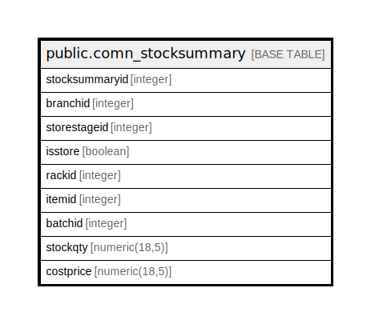

# public.comn_stocksummary

## Description

Current stock of each Item/Batch.

## Columns

| Name | Type | Default | Nullable | Children | Parents | Comment |
| ---- | ---- | ------- | -------- | -------- | ------- | ------- |
| stocksummaryid | integer | nextval('stk_stocksummaryid'::regclass) | false |  |  |  |
| branchid | integer |  | false |  |  |  |
| storestageid | integer |  | false |  |  |  |
| isstore | boolean |  | false |  |  |  |
| rackid | integer |  | false |  |  |  |
| itemid | integer |  | false |  |  |  |
| batchid | integer |  | false |  |  |  |
| stockqty | numeric(18,5) | 0 | false |  |  | StockQty based on StockDetail Sum(In)-Sum(Out). |
| costprice | numeric(18,5) | 0 | false |  |  | Average cost of current stock. |

## Constraints

| Name | Type | Definition |
| ---- | ---- | ---------- |
| comn_stocksummary_pkey | PRIMARY KEY | PRIMARY KEY (branchid, storestageid, isstore, rackid, itemid, batchid) |
| comn_stocksummary_stocksummaryid_key | UNIQUE | UNIQUE (stocksummaryid) |

## Indexes

| Name | Definition |
| ---- | ---------- |
| comn_stocksummary_pkey | CREATE UNIQUE INDEX comn_stocksummary_pkey ON public.comn_stocksummary USING btree (branchid, storestageid, isstore, rackid, itemid, batchid) |
| comn_stocksummary_stocksummaryid_key | CREATE UNIQUE INDEX comn_stocksummary_stocksummaryid_key ON public.comn_stocksummary USING btree (stocksummaryid) |

## Relations

---

> Generated by [tbls](https://github.com/k1LoW/tbls)
