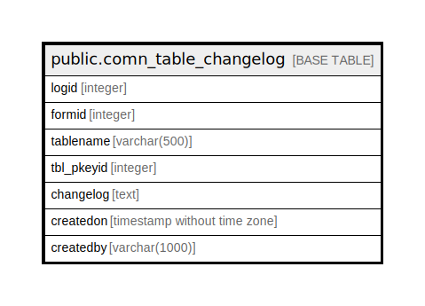

# public.comn_table_changelog

## Description

## Columns

| Name | Type | Default | Nullable | Children | Parents | Comment |
| ---- | ---- | ------- | -------- | -------- | ------- | ------- |
| logid | integer | nextval('comn_table_changelog_logid_seq'::regclass) | false |  |  |  |
| formid | integer |  | true |  |  |  |
| tablename | varchar(500) |  | true |  |  |  |
| tbl_pkeyid | integer |  | true |  |  |  |
| changelog | text |  | true |  |  |  |
| createdon | timestamp without time zone | now() | true |  |  |  |
| createdby | varchar(1000) | NULL::character varying | true |  |  |  |

## Constraints

| Name | Type | Definition |
| ---- | ---- | ---------- |
| comn_table_changelog_pkey | PRIMARY KEY | PRIMARY KEY (logid) |

## Indexes

| Name | Definition |
| ---- | ---------- |
| comn_table_changelog_pkey | CREATE UNIQUE INDEX comn_table_changelog_pkey ON public.comn_table_changelog USING btree (logid) |

## Relations

---

> Generated by [tbls](https://github.com/k1LoW/tbls)
