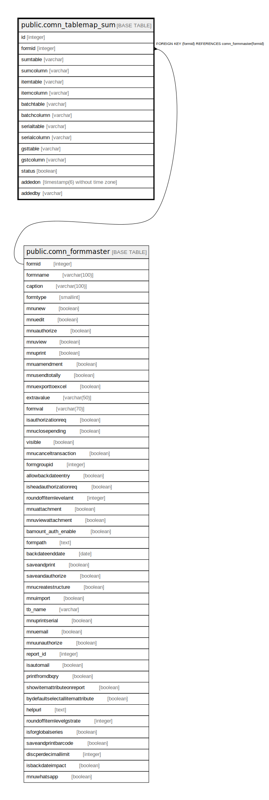

# public.comn_tablemap_sum

## Description

## Columns

| Name | Type | Default | Nullable | Children | Parents | Comment |
| ---- | ---- | ------- | -------- | -------- | ------- | ------- |
| id | integer | nextval('comn_tablemap_sum_id'::regclass) | false |  |  |  |
| formid | integer |  | false |  | [public.comn_formmaster](public.comn_formmaster.md) |  |
| sumtable | varchar |  | true |  |  |  |
| sumcolumn | varchar |  | true |  |  |  |
| itemtable | varchar |  | true |  |  |  |
| itemcolumn | varchar |  | true |  |  |  |
| batchtable | varchar |  | true |  |  |  |
| batchcolumn | varchar |  | true |  |  |  |
| serialtable | varchar |  | true |  |  |  |
| serialcolumn | varchar |  | true |  |  |  |
| gsttable | varchar |  | true |  |  |  |
| gstcolumn | varchar |  | true |  |  |  |
| status | boolean | true | false |  |  |  |
| addedon | timestamp(6) without time zone | now() | false |  |  |  |
| addedby | varchar |  | false |  |  |  |

## Constraints

| Name | Type | Definition |
| ---- | ---- | ---------- |
| comn_tablemap_sum_pkey | PRIMARY KEY | PRIMARY KEY (id) |
| comn_tablemap_sum_formid_fkey | FOREIGN KEY | FOREIGN KEY (formid) REFERENCES comn_formmaster(formid) |

## Indexes

| Name | Definition |
| ---- | ---------- |
| comn_tablemap_sum_pkey | CREATE UNIQUE INDEX comn_tablemap_sum_pkey ON public.comn_tablemap_sum USING btree (id) |

## Relations

---

> Generated by [tbls](https://github.com/k1LoW/tbls)
