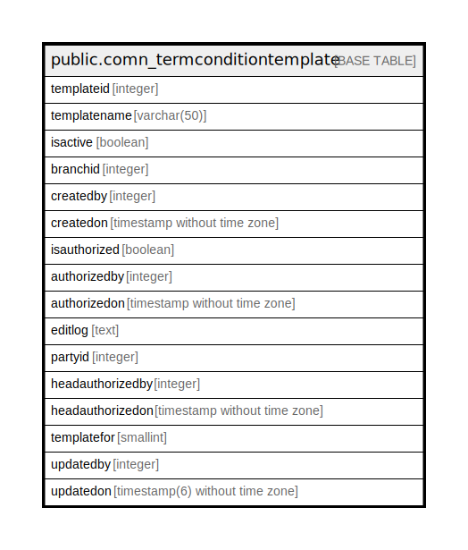

# public.comn_termconditiontemplate

## Description

## Columns

| Name | Type | Default | Nullable | Children | Parents | Comment |
| ---- | ---- | ------- | -------- | -------- | ------- | ------- |
| templateid | integer | nextval('comn_termconditiontemplate_templateid_seq'::regclass) | false |  |  |  |
| templatename | varchar(50) |  | true |  |  |  |
| isactive | boolean | true | false |  |  |  |
| branchid | integer |  | true |  |  |  |
| createdby | integer |  | true |  |  |  |
| createdon | timestamp without time zone |  | true |  |  |  |
| isauthorized | boolean | false | false |  |  |  |
| authorizedby | integer |  | true |  |  |  |
| authorizedon | timestamp without time zone |  | true |  |  |  |
| editlog | text |  | true |  |  |  |
| partyid | integer |  | true |  |  |  |
| headauthorizedby | integer |  | true |  |  |  |
| headauthorizedon | timestamp without time zone |  | true |  |  |  |
| templatefor | smallint | 2 | true |  |  |  |
| updatedby | integer |  | true |  |  |  |
| updatedon | timestamp(6) without time zone | NULL::timestamp without time zone | true |  |  |  |

## Constraints

| Name | Type | Definition |
| ---- | ---- | ---------- |
| Template_Unique | UNIQUE | UNIQUE (templatename, branchid) |
| termconditiontemplate_pkey | PRIMARY KEY | PRIMARY KEY (templateid) |

## Indexes

| Name | Definition |
| ---- | ---------- |
| Template_Unique | CREATE UNIQUE INDEX "Template_Unique" ON public.comn_termconditiontemplate USING btree (templatename, branchid) |
| termconditiontemplate_pkey | CREATE UNIQUE INDEX termconditiontemplate_pkey ON public.comn_termconditiontemplate USING btree (templateid) |

## Relations

---

> Generated by [tbls](https://github.com/k1LoW/tbls)
