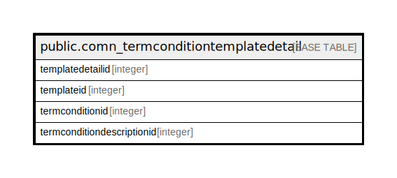

# public.comn_termconditiontemplatedetail

## Description

## Columns

| Name | Type | Default | Nullable | Children | Parents | Comment |
| ---- | ---- | ------- | -------- | -------- | ------- | ------- |
| templatedetailid | integer | nextval('comn_termconditiontemplatedetail_templatedetailid_seq'::regclass) | false |  |  |  |
| templateid | integer |  | true |  |  |  |
| termconditionid | integer |  | true |  |  |  |
| termconditiondescriptionid | integer |  | true |  |  |  |

## Constraints

| Name | Type | Definition |
| ---- | ---- | ---------- |
| termcondition_unique | UNIQUE | UNIQUE (termconditionid, templateid) |

## Indexes

| Name | Definition |
| ---- | ---------- |
| termcondition_unique | CREATE UNIQUE INDEX termcondition_unique ON public.comn_termconditiontemplatedetail USING btree (termconditionid, templateid) |

## Relations

---

> Generated by [tbls](https://github.com/k1LoW/tbls)
