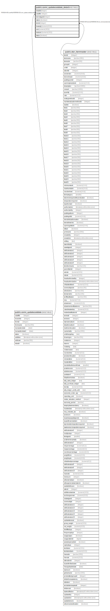

# public.comn_updatecostdate_detail

## Description

## Columns

| Name | Type | Default | Nullable | Children | Parents | Comment |
| ---- | ---- | ------- | -------- | -------- | ------- | ------- |
| detailid | integer | nextval('seq_comn_updatecostdate_detailid'::regclass) | false |  |  |  |
| cuttoffid | integer |  | false |  | [public.comn_updatecostdate](public.comn_updatecostdate.md) |  |
| storestageid | integer |  | false |  |  |  |
| isstore | boolean |  | false |  |  |  |
| itemid | integer |  | false |  | [public.stor_itemmaster](public.stor_itemmaster.md) |  |
| baseqty | numeric(18,3) | 0 | false |  |  |  |
| cost | numeric(18,5) | 0 | false |  |  |  |
| totalcost | numeric(18,5) | 0 | false |  |  |  |
| status | boolean | true | false |  |  |  |

## Constraints

| Name | Type | Definition |
| ---- | ---- | ---------- |
| comn_updatecostdate_detail_cuttoffid_fkey | FOREIGN KEY | FOREIGN KEY (cuttoffid) REFERENCES comn_updatecostdate(cuttoffid) |
| pk_seq_comn_updatecostdate_det | PRIMARY KEY | PRIMARY KEY (cuttoffid, storestageid, itemid, isstore) |
| comn_updatecostdate_detail_itemid_fkey | FOREIGN KEY | FOREIGN KEY (itemid) REFERENCES stor_itemmaster(itemid) |

## Indexes

| Name | Definition |
| ---- | ---------- |
| pk_seq_comn_updatecostdate_det | CREATE UNIQUE INDEX pk_seq_comn_updatecostdate_det ON public.comn_updatecostdate_detail USING btree (cuttoffid, storestageid, itemid, isstore) |

## Relations

---

> Generated by [tbls](https://github.com/k1LoW/tbls)
