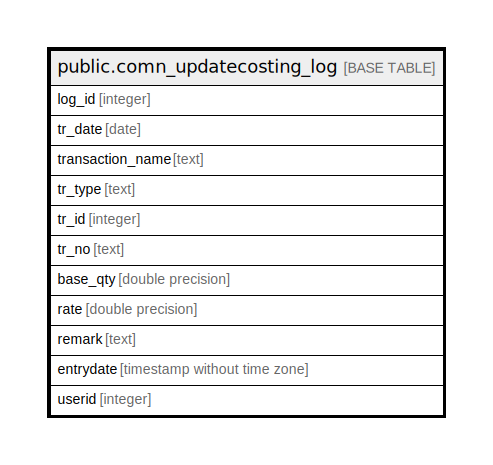

# public.comn_updatecosting_log

## Description

## Columns

| Name | Type | Default | Nullable | Children | Parents | Comment |
| ---- | ---- | ------- | -------- | -------- | ------- | ------- |
| log_id | integer | nextval('comn_updatecosting_log_log_id_seq'::regclass) | false |  |  |  |
| tr_date | date |  | false |  |  |  |
| transaction_name | text |  | true |  |  |  |
| tr_type | text |  | false |  |  |  |
| tr_id | integer |  | false |  |  |  |
| tr_no | text |  | true |  |  |  |
| base_qty | double precision |  | true |  |  |  |
| rate | double precision |  | true |  |  |  |
| remark | text |  | true |  |  |  |
| entrydate | timestamp without time zone | now() | false |  |  |  |
| userid | integer |  | true |  |  |  |

## Constraints

| Name | Type | Definition |
| ---- | ---- | ---------- |
| comn_updatecosting_log_pkey | PRIMARY KEY | PRIMARY KEY (log_id) |

## Indexes

| Name | Definition |
| ---- | ---------- |
| comn_updatecosting_log_pkey | CREATE UNIQUE INDEX comn_updatecosting_log_pkey ON public.comn_updatecosting_log USING btree (log_id) |

## Relations

---

> Generated by [tbls](https://github.com/k1LoW/tbls)
