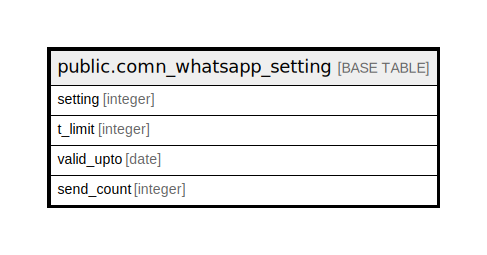

# public.comn_whatsapp_setting

## Description

## Columns

| Name | Type | Default | Nullable | Children | Parents | Comment |
| ---- | ---- | ------- | -------- | -------- | ------- | ------- |
| setting | integer | nextval('comn_whatsapp_setting_setting_seq'::regclass) | false |  |  |  |
| t_limit | integer |  | true |  |  |  |
| valid_upto | date | '2001-01-01'::date | true |  |  |  |
| send_count | integer | 0 | true |  |  |  |

## Constraints

| Name | Type | Definition |
| ---- | ---- | ---------- |
| comn_whatsapp_setting_pkey | PRIMARY KEY | PRIMARY KEY (setting) |

## Indexes

| Name | Definition |
| ---- | ---------- |
| comn_whatsapp_setting_pkey | CREATE UNIQUE INDEX comn_whatsapp_setting_pkey ON public.comn_whatsapp_setting USING btree (setting) |

## Relations

---

> Generated by [tbls](https://github.com/k1LoW/tbls)
