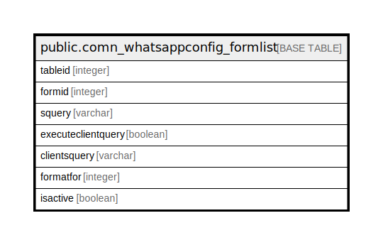

# public.comn_whatsappconfig_formlist

## Description

## Columns

| Name | Type | Default | Nullable | Children | Parents | Comment |
| ---- | ---- | ------- | -------- | -------- | ------- | ------- |
| tableid | integer | nextval('comn_whatsappconfig_formlist_tableid_seq'::regclass) | false |  |  |  |
| formid | integer |  | true |  |  |  |
| squery | varchar |  | true |  |  |  |
| executeclientquery | boolean | false | true |  |  |  |
| clientsquery | varchar |  | true |  |  |  |
| formatfor | integer | 0 | true |  |  |  |
| isactive | boolean | false | true |  |  |  |

## Constraints

| Name | Type | Definition |
| ---- | ---- | ---------- |
| comn_whatsappconfig_formlist_pkey | PRIMARY KEY | PRIMARY KEY (tableid) |
| comn_whatsappconfig_formlist_unique | UNIQUE | UNIQUE (formid, formatfor) |

## Indexes

| Name | Definition |
| ---- | ---------- |
| comn_whatsappconfig_formlist_pkey | CREATE UNIQUE INDEX comn_whatsappconfig_formlist_pkey ON public.comn_whatsappconfig_formlist USING btree (tableid) |
| comn_whatsappconfig_formlist_unique | CREATE UNIQUE INDEX comn_whatsappconfig_formlist_unique ON public.comn_whatsappconfig_formlist USING btree (formid, formatfor) |

## Relations

---

> Generated by [tbls](https://github.com/k1LoW/tbls)
