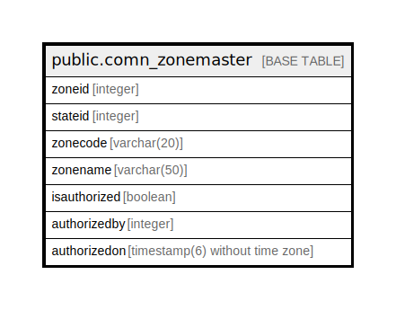

# public.comn_zonemaster

## Description

## Columns

| Name | Type | Default | Nullable | Children | Parents | Comment |
| ---- | ---- | ------- | -------- | -------- | ------- | ------- |
| zoneid | integer | nextval('comn_zonemaster_zoneid_seq'::regclass) | false |  |  |  |
| stateid | integer |  | true |  |  |  |
| zonecode | varchar(20) |  | true |  |  |  |
| zonename | varchar(50) |  | true |  |  |  |
| isauthorized | boolean |  | true |  |  |  |
| authorizedby | integer |  | true |  |  |  |
| authorizedon | timestamp(6) without time zone |  | true |  |  |  |

## Constraints

| Name | Type | Definition |
| ---- | ---- | ---------- |
| pk_zoneid | PRIMARY KEY | PRIMARY KEY (zoneid) |

## Indexes

| Name | Definition |
| ---- | ---------- |
| pk_zoneid | CREATE UNIQUE INDEX pk_zoneid ON public.comn_zonemaster USING btree (zoneid) |

## Relations

---

> Generated by [tbls](https://github.com/k1LoW/tbls)
