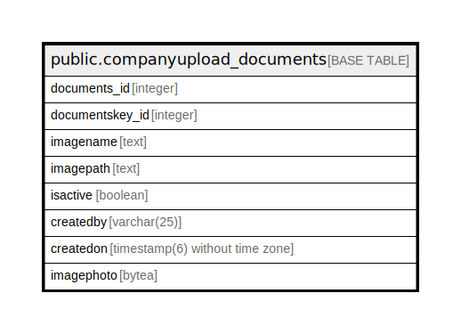

# public.companyupload_documents

## Description

## Columns

| Name | Type | Default | Nullable | Children | Parents | Comment |
| ---- | ---- | ------- | -------- | -------- | ------- | ------- |
| documents_id | integer | nextval('companyupload_documents_documents_id_seq'::regclass) | false |  |  |  |
| documentskey_id | integer |  | true |  |  |  |
| imagename | text |  | true |  |  |  |
| imagepath | text |  | true |  |  |  |
| isactive | boolean | true | true |  |  |  |
| createdby | varchar(25) |  | true |  |  |  |
| createdon | timestamp(6) without time zone | now() | true |  |  |  |
| imagephoto | bytea |  | true |  |  |  |

## Constraints

| Name | Type | Definition |
| ---- | ---- | ---------- |
| companylinks_document_pkey | PRIMARY KEY | PRIMARY KEY (documents_id) |

## Indexes

| Name | Definition |
| ---- | ---------- |
| companylinks_document_pkey | CREATE UNIQUE INDEX companylinks_document_pkey ON public.companyupload_documents USING btree (documents_id) |

## Relations

---

> Generated by [tbls](https://github.com/k1LoW/tbls)
