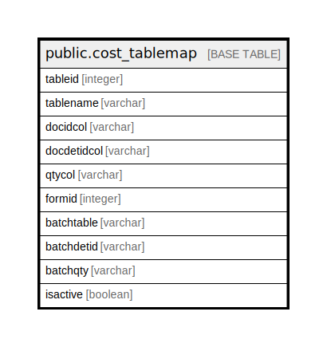

# public.cost_tablemap

## Description

## Columns

| Name | Type | Default | Nullable | Children | Parents | Comment |
| ---- | ---- | ------- | -------- | -------- | ------- | ------- |
| tableid | integer |  | false |  |  |  |
| tablename | varchar |  | false |  |  |  |
| docidcol | varchar |  | false |  |  |  |
| docdetidcol | varchar |  | false |  |  |  |
| qtycol | varchar |  | false |  |  |  |
| formid | integer |  | true |  |  |  |
| batchtable | varchar |  | true |  |  |  |
| batchdetid | varchar |  | true |  |  |  |
| batchqty | varchar |  | true |  |  |  |
| isactive | boolean |  | false |  |  |  |

## Relations

---

> Generated by [tbls](https://github.com/k1LoW/tbls)
