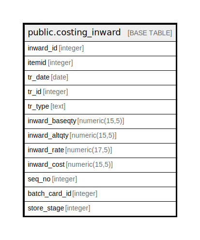

# public.costing_inward

## Description

## Columns

| Name | Type | Default | Nullable | Children | Parents | Comment |
| ---- | ---- | ------- | -------- | -------- | ------- | ------- |
| inward_id | integer | nextval('costing_inward_inward_id_seq'::regclass) | false |  |  |  |
| itemid | integer |  | false |  |  |  |
| tr_date | date |  | false |  |  |  |
| tr_id | integer |  | false |  |  |  |
| tr_type | text |  | false |  |  |  |
| inward_baseqty | numeric(15,5) |  | false |  |  |  |
| inward_altqty | numeric(15,5) |  | false |  |  |  |
| inward_rate | numeric(17,5) |  | false |  |  |  |
| inward_cost | numeric(15,5) |  | false |  |  |  |
| seq_no | integer |  | false |  |  |  |
| batch_card_id | integer |  | true |  |  |  |
| store_stage | integer |  | false |  |  |  |

## Constraints

| Name | Type | Definition |
| ---- | ---- | ---------- |
| costing_inward_pkey | PRIMARY KEY | PRIMARY KEY (inward_id) |

## Indexes

| Name | Definition |
| ---- | ---------- |
| costing_inward_pkey | CREATE UNIQUE INDEX costing_inward_pkey ON public.costing_inward USING btree (inward_id) |

## Relations

---

> Generated by [tbls](https://github.com/k1LoW/tbls)
