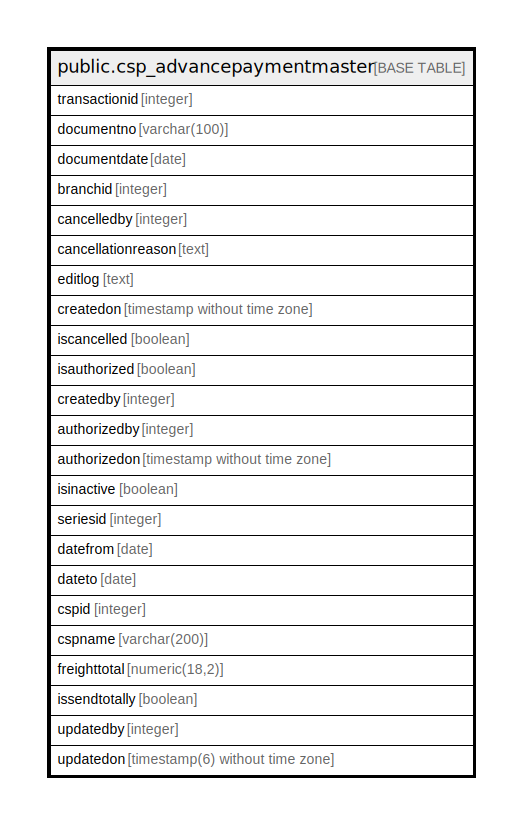

# public.csp_advancepaymentmaster

## Description

## Columns

| Name | Type | Default | Nullable | Children | Parents | Comment |
| ---- | ---- | ------- | -------- | -------- | ------- | ------- |
| transactionid | integer | nextval('csp_advancepaymentmaster_transactionid_seq'::regclass) | false |  |  |  |
| documentno | varchar(100) |  | true |  |  |  |
| documentdate | date |  | true |  |  |  |
| branchid | integer |  | true |  |  |  |
| cancelledby | integer |  | true |  |  |  |
| cancellationreason | text |  | true |  |  |  |
| editlog | text |  | true |  |  |  |
| createdon | timestamp without time zone | now() | true |  |  |  |
| iscancelled | boolean | false | true |  |  |  |
| isauthorized | boolean | false | true |  |  |  |
| createdby | integer |  | true |  |  |  |
| authorizedby | integer |  | true |  |  |  |
| authorizedon | timestamp without time zone | now() | true |  |  |  |
| isinactive | boolean |  | true |  |  |  |
| seriesid | integer |  | true |  |  |  |
| datefrom | date |  | true |  |  |  |
| dateto | date |  | true |  |  |  |
| cspid | integer |  | true |  |  |  |
| cspname | varchar(200) |  | true |  |  |  |
| freighttotal | numeric(18,2) |  | true |  |  |  |
| issendtotally | boolean | false | true |  |  |  |
| updatedby | integer |  | true |  |  |  |
| updatedon | timestamp(6) without time zone | NULL::timestamp without time zone | true |  |  |  |

## Relations

---

> Generated by [tbls](https://github.com/k1LoW/tbls)
