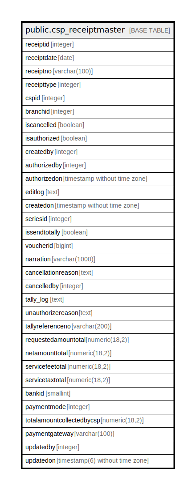

# public.csp_receiptmaster

## Description

## Columns

| Name | Type | Default | Nullable | Children | Parents | Comment |
| ---- | ---- | ------- | -------- | -------- | ------- | ------- |
| receiptid | integer | nextval('csp_receiptmaster_receiptid_seq'::regclass) | false |  |  |  |
| receiptdate | date |  | true |  |  |  |
| receiptno | varchar(100) |  | true |  |  |  |
| receipttype | integer |  | true |  |  |  |
| cspid | integer |  | true |  |  |  |
| branchid | integer |  | true |  |  |  |
| iscancelled | boolean | false | true |  |  |  |
| isauthorized | boolean | false | true |  |  |  |
| createdby | integer |  | true |  |  |  |
| authorizedby | integer |  | true |  |  |  |
| authorizedon | timestamp without time zone | now() | true |  |  |  |
| editlog | text |  | true |  |  |  |
| createdon | timestamp without time zone | now() | true |  |  |  |
| seriesid | integer |  | true |  |  |  |
| issendtotally | boolean | false | true |  |  |  |
| voucherid | bigint |  | true |  |  |  |
| narration | varchar(1000) | ''::character varying | true |  |  |  |
| cancellationreason | text |  | true |  |  |  |
| cancelledby | integer |  | true |  |  |  |
| tally_log | text | ''::text | true |  |  |  |
| unauthorizereason | text |  | true |  |  |  |
| tallyreferenceno | varchar(200) |  | true |  |  |  |
| requestedamountotal | numeric(18,2) |  | true |  |  |  |
| netamounttotal | numeric(18,2) |  | true |  |  |  |
| servicefeetotal | numeric(18,2) |  | true |  |  |  |
| servicetaxtotal | numeric(18,2) |  | true |  |  |  |
| bankid | smallint |  | true |  |  |  |
| paymentmode | integer |  | true |  |  |  |
| totalamountcollectedbycsp | numeric(18,2) |  | true |  |  |  |
| paymentgateway | varchar(100) |  | true |  |  |  |
| updatedby | integer |  | true |  |  |  |
| updatedon | timestamp(6) without time zone | NULL::timestamp without time zone | true |  |  |  |

## Constraints

| Name | Type | Definition |
| ---- | ---- | ---------- |
| csp_receiptmaster_pkey | PRIMARY KEY | PRIMARY KEY (receiptid) |

## Indexes

| Name | Definition |
| ---- | ---------- |
| csp_receiptmaster_pkey | CREATE UNIQUE INDEX csp_receiptmaster_pkey ON public.csp_receiptmaster USING btree (receiptid) |

## Relations

---

> Generated by [tbls](https://github.com/k1LoW/tbls)
