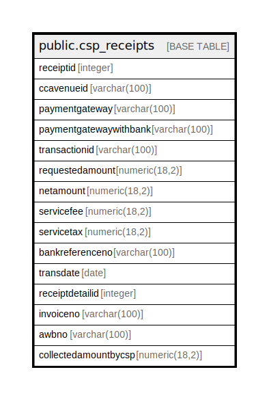

# public.csp_receipts

## Description

## Columns

| Name | Type | Default | Nullable | Children | Parents | Comment |
| ---- | ---- | ------- | -------- | -------- | ------- | ------- |
| receiptid | integer |  | true |  |  |  |
| ccavenueid | varchar(100) |  | true |  |  |  |
| paymentgateway | varchar(100) |  | true |  |  |  |
| paymentgatewaywithbank | varchar(100) |  | true |  |  |  |
| transactionid | varchar(100) |  | true |  |  |  |
| requestedamount | numeric(18,2) |  | true |  |  |  |
| netamount | numeric(18,2) |  | true |  |  |  |
| servicefee | numeric(18,2) |  | true |  |  |  |
| servicetax | numeric(18,2) |  | true |  |  |  |
| bankreferenceno | varchar(100) |  | true |  |  |  |
| transdate | date |  | true |  |  |  |
| receiptdetailid | integer | nextval('csp_receipts_receiptdetailid_seq'::regclass) | false |  |  |  |
| invoiceno | varchar(100) |  | true |  |  |  |
| awbno | varchar(100) |  | true |  |  |  |
| collectedamountbycsp | numeric(18,2) |  | true |  |  |  |

## Triggers

| Name | Definition |
| ---- | ---------- |
| check_duplicate | CREATE TRIGGER check_duplicate AFTER INSERT OR UPDATE ON public.csp_receipts FOR EACH ROW EXECUTE FUNCTION csp_receipt_awb_invoiceno_duplicacy() |

## Relations

---

> Generated by [tbls](https://github.com/k1LoW/tbls)
