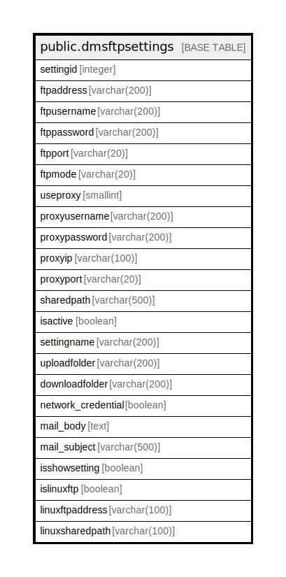

# public.dmsftpsettings

## Description

## Columns

| Name | Type | Default | Nullable | Children | Parents | Comment |
| ---- | ---- | ------- | -------- | -------- | ------- | ------- |
| settingid | integer |  | false |  |  |  |
| ftpaddress | varchar(200) |  | true |  |  |  |
| ftpusername | varchar(200) |  | true |  |  |  |
| ftppassword | varchar(200) |  | true |  |  |  |
| ftpport | varchar(20) |  | true |  |  |  |
| ftpmode | varchar(20) |  | true |  |  |  |
| useproxy | smallint |  | true |  |  |  |
| proxyusername | varchar(200) |  | true |  |  |  |
| proxypassword | varchar(200) |  | true |  |  |  |
| proxyip | varchar(100) |  | true |  |  |  |
| proxyport | varchar(20) |  | true |  |  |  |
| sharedpath | varchar(500) |  | true |  |  |  |
| isactive | boolean |  | true |  |  |  |
| settingname | varchar(200) |  | false |  |  |  |
| uploadfolder | varchar(200) |  | true |  |  |  |
| downloadfolder | varchar(200) |  | true |  |  |  |
| network_credential | boolean |  | true |  |  |  |
| mail_body | text |  | true |  |  |  |
| mail_subject | varchar(500) |  | true |  |  |  |
| isshowsetting | boolean |  | true |  |  |  |
| islinuxftp | boolean | false | true |  |  |  |
| linuxftpaddress | varchar(100) | ''::character varying | true |  |  |  |
| linuxsharedpath | varchar(100) | ''::character varying | true |  |  |  |

## Constraints

| Name | Type | Definition |
| ---- | ---- | ---------- |
| dmsftpsettings_pkey | PRIMARY KEY | PRIMARY KEY (settingid, settingname) |

## Indexes

| Name | Definition |
| ---- | ---------- |
| dmsftpsettings_pkey | CREATE UNIQUE INDEX dmsftpsettings_pkey ON public.dmsftpsettings USING btree (settingid, settingname) |

## Relations

---

> Generated by [tbls](https://github.com/k1LoW/tbls)
